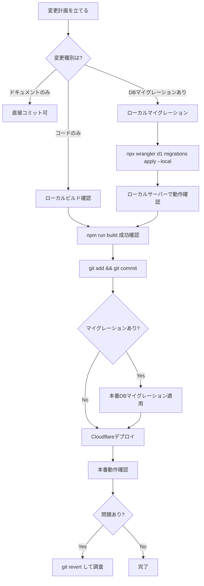

# AI_CONTEXT.md — AI操作ガイド

> **GolfWing 仕入発注管理システム**  
> このドキュメントは、AIエージェントがこのシステムを安全に理解・操作・改善するための**専用ガイド**です。  
> 最終更新: 2025-06-25

---

## ⚠️ このドキュメントを最初に読んでください

このシステムは**本番稼働中（tenant_id=1: ゴルフウィング）**です。  
不適切な操作は**実際のビジネス被害**（発注データ消失・認証崩壊）につながります。  
以下のルールを必ず遵守してください。

---

## 1. システムの役割

```
GolfWing 仕入発注管理システム
  ├── 誰が使う: ゴルフウィング社 購買担当者
  ├── 何をする: ゴルフ用品の仕入先への発注・入荷管理
  ├── どこで動く: Cloudflare Workers + Pages (エッジランタイム)
  ├── データ: Cloudflare D1 (golfwing-production)
  └── 稼働状況: 本番稼働中（tenant_id=1）/ デモ稼働中（tenant_id=0）
```

### システムが解決している業務
1. **仕入先選定の自動化** — `resolveSupplier()` が商品に紐づく仕入先を自動判定
2. **発注メール生成** — 発注データからメール文を自動生成（現在は `mailto:` リンク）
3. **入荷管理** — 発注に対する入荷確認・部分入荷の追跡
4. **マルチテナント** — デモ環境と本番環境を完全分離

### システムの重要なビジネスロジック
```typescript
// src/routes/api.ts — resolveSupplier()
// 優先順位: product_suppliers（個別設定）→ products.default_supplier_id → supplier_rules（ルール）
async function resolveSupplier(db: D1Database, productId: number, tenantId: number) {
  // 1. product_suppliers テーブルを確認（最優先）
  // 2. products.default_supplier_id を確認
  // 3. supplier_rules テーブルを確認（フォールバック）
}
```

---

## 2. AIが操作してよい範囲

### ✅ 安全に変更できるもの

#### ドキュメント
```
docs/                 # すべてのMarkdownドキュメント
README.md             # プロジェクト説明
```

#### 新規マイグレーション（ローカルテスト必須）
```
migrations/0014_xxx.sql   # 新規ファイルのみ（既存ファイルは絶対変更禁止）
migrations/0015_xxx.sql
```
> ⚠️ 本番適用前に必ず `--local` でテスト: `npx wrangler d1 migrations apply golfwing-production --local`

#### バグ修正（低リスク）
```
src/routes/api.ts         # APIバグ修正・新エンドポイント追加
src/xlsxHelper.ts         # Excel生成バグ修正
public/static/            # フロントエンドJS修正
```

#### 新機能追加（影響範囲確認後）
```
src/routes/               # 新規ファイルのみ
src/middleware/           # 新規ファイルのみ
src/services/             # 新規ファイルのみ
```

---

### ❌ 絶対に触ってはいけないもの

#### 1. 既存マイグレーションファイル
```
migrations/0001_initial_schema.sql    # ❌ 変更禁止
migrations/0002_*.sql                 # ❌ 変更禁止
...
migrations/0013_*.sql                 # ❌ 変更禁止
```
**理由:** マイグレーションは一方向（巻き戻し不可）。既存ファイルの変更は本番DBとの不整合を引き起こし、アプリ全体が停止します。

#### 2. 認証コアロジック（セキュリティ破壊リスク）
```typescript
// src/auth.ts — 以下の関数は単独変更禁止
generateToken()    // トークン形式変更 → 全ユーザーのセッション無効化
verifyToken()      // 検証ロジック変更 → 認証バイパス可能
```
**修正が必要な場合:** 必ずセキュリティレビューを受け、ステージング環境でテストしてから本番適用。

#### 3. 本番D1への直接クエリ
```bash
# ❌ 絶対禁止
npx wrangler d1 execute golfwing-production --command="DELETE FROM ..."
npx wrangler d1 execute golfwing-production --command="UPDATE users SET ..."

# ✅ ローカルテスト用のみ許可
npx wrangler d1 execute golfwing-production --local --command="SELECT ..."
```

#### 4. マルチテナント分離ロジック
```typescript
// ❌ 絶対変更禁止
const tenantId = sessionUser.tenantId  // テナントIDを動的に変える処理
// WHERE tenant_id = ? のバインディングを省略することは絶対禁止
```
**理由:** テナント分離が崩れると、デモデータと本番データが混在します。

#### 5. Cronハンドラーのデモリセット対象
```typescript
// src/index.tsx — resetDemoData()
// tenant_id=0 のデータのみリセット。この条件を変更すると本番データが毎日消える
WHERE tenant_id = 0  // ❌ この条件は絶対変更禁止
```

#### 6. パスワード関連（現在の脆弱性を悪用させない）
```typescript
// src/auth.ts
// 現在パスワードは平文保存（TD-001: 技術的負債）
// AIは現在の仕組みを理解した上で、ROADMAP.md の修正計画に従って対応すること
// 「パスワードを確認する」ためにusersテーブルを直接読み出すことは禁止
```

---

## 3. 本番変更ルール（変更時は必ずこの手順を守る）

### 標準変更フロー



### 詳細手順

#### Step 1: ローカル環境での確認
```bash
# コードビルド確認
cd /home/user/webapp && npm run build

# ローカルサーバー起動
cd /home/user/webapp && pm2 start ecosystem.config.cjs

# ブラウザまたはcurlで確認
curl http://localhost:3000/api/orders
```

#### Step 2: DBマイグレーションがある場合
```bash
# ローカルマイグレーション確認
npx wrangler d1 migrations apply golfwing-production --local

# マイグレーション後の動作確認
curl http://localhost:3000/api/products
```

#### Step 3: コミット
```bash
git add -A
git commit -m "feat: XXX機能追加

- 変更の詳細を箇条書き
- 影響範囲を明記
- 技術的負債への対応ならTD-XXXを参照"
```

#### Step 4: 本番DBマイグレーション（ある場合のみ）
```bash
# ⚠️ 本番適用は一方向（巻き戻し不可）
npx wrangler d1 migrations apply golfwing-production
# --remote フラグなしで実行（wrangler.jsonc で production DB が設定済み）
```

#### Step 5: デプロイ
```bash
npm run deploy
# = npm run build && wrangler pages deploy dist
```

#### Step 6: 本番確認
```bash
# 本番URLで動作確認
curl https://golfwing.pages.dev/api/orders
# または直接ブラウザアクセス
```

---

## 4. 重要な実装パターンの理解

### セッション管理
```typescript
// Cookie名: gw_session
// 形式: "username:tenantId:expires:HMAC署名"
// 有効期限: 7日
// 署名アルゴリズム: HMAC-SHA256

// セッション取得
const sessionUser = c.get('sessionUser') as SessionUser
// { username: string, tenantId: number, displayName: string, isDemo: boolean, isAdmin: boolean }
```

### テナントID規則
```
tenant_id = 0 → デモ環境（毎日UTC 15:00にリセット）
tenant_id = 1 → ゴルフウィング本番環境

// すべてのクエリにWHERE tenant_id = ?が必要
const results = await db.prepare('SELECT * FROM products WHERE tenant_id = ?')
  .bind(sessionUser.tenantId)
  .all()
```

### デモモードブロック
```typescript
// src/routes/api.ts
// デモユーザーはGET以外の操作ができない
if (sessionUser?.isDemo && !['GET','HEAD'].includes(c.req.method)) {
  return c.json({ error: 'デモモードでは書き込み操作はできません。', demo: true }, 403)
}
```

### purchase_orders ステータス遷移
```
draft → draft_created → ordered → partial（部分入荷）
                                → completed（完全入荷）
                                → cancelled

pool → （上記と同様） ※プール発注
```

### resolveSupplier() 優先順位（重要）
```typescript
// 1. product_suppliers テーブルで is_default=1 のレコードを検索
// 2. なければ products.default_supplier_id を使用
// 3. なければ supplier_rules テーブルでカテゴリマッチを検索
// すべてなければ null を返す（手動選択を促す）
```

---

## 5. よくあるAI操作の落とし穴

### ❌ NG: マイグレーション既存ファイルの変更
```bash
# NG: 既存マイグレーションを編集することは絶対禁止
vim migrations/0001_initial_schema.sql  # ❌

# OK: 新規マイグレーションファイルを作成
vim migrations/0014_add_xxx.sql  # ✅
```

### ❌ NG: tenant_id なしのクエリ
```typescript
// ❌ テナント分離違反（全テナントのデータが混在する）
const orders = await db.prepare('SELECT * FROM purchase_orders').all()

// ✅ 必ずtenant_idで絞り込む
const orders = await db.prepare('SELECT * FROM purchase_orders WHERE tenant_id = ?')
  .bind(sessionUser.tenantId).all()
```

### ❌ NG: Node.js APIの使用
```typescript
// ❌ Workers環境ではNode.js APIは使えない
import { readFileSync } from 'fs'
import { createHash } from 'crypto'

// ✅ Web APIを使用する
const hash = await crypto.subtle.digest('SHA-256', data)
```

### ❌ NG: serveStaticのインポート先間違い
```typescript
// ❌ Node.js用（Workers環境では動作しない）
import { serveStatic } from '@hono/node-server/serve-static'

// ✅ Cloudflare Workers用
import { serveStatic } from 'hono/cloudflare-workers'
```

### ❌ NG: 本番へのSELECT以外の直接実行
```bash
# ❌ 本番DBへの直接変更（マイグレーション経由でのみ変更可能）
npx wrangler d1 execute golfwing-production --command="INSERT INTO ..."

# ✅ ローカルテスト用SELECT
npx wrangler d1 execute golfwing-production --local --command="SELECT COUNT(*) FROM products"
```

---

## 6. 他システムとの関係

### 現在の接続（2025-06-25時点）
```
GolfWing
  ├── Cloudflare D1: golfwing-production（直接接続）
  ├── メール送信: メールクライアント（mailto: リンク経由・直接接続なし）
  └── YOZAN Genesis: 未接続（ROADMAP Phase 2 で実装予定）
```

### 将来の接続（ROADMAP.md参照）
```
GolfWing
  ├── YOZAN Genesis: APIアダプター（/genesis/orders）
  ├── Resend: メール送信API（ROADMAP MP-001）
  ├── Cloudflare Workers AI: 発注予測（ROADMAP LP-002）
  └── Stripe: SaaS課金（ROADMAP LP-003）
```

### YOZAN Genesis との関係
- GolfWing は「仕入発注管理モジュール」として統合予定
- 再利用できるコア: `resolveSupplier()`、D1スキーマ設計、xlsxHelper.ts
- 詳細は [YOZAN_GENESIS.md](./YOZAN_GENESIS.md) を参照

---

## 7. デバッグガイド

### ログの確認
```bash
# PM2ログ（開発環境）
pm2 logs golfwing --nostream

# Cloudflare Workersログ（本番）
npx wrangler pages deployment tail
```

### よくあるエラーと対処

#### 「デモモードでは書き込み操作はできません」
```
原因: デモユーザー（tenant_id=0）でPOST/PUT/DELETEを実行
対処: 本番ユーザーでログインし直す
```

#### 「Unauthorized」（401エラー）
```
原因: セッションCookie（gw_session）の期限切れまたは無効
対処: 再ログイン。AUTH_SECRETが変更された場合は全ユーザーが再ログイン必要
```

#### ビルドエラー: "Cannot find module"
```bash
cd /home/user/webapp && npm install  # 依存関係の再インストール
```

#### D1エラー: "no such table"
```bash
# ローカルDBにマイグレーション未適用の可能性
npx wrangler d1 migrations apply golfwing-production --local
```

---

## 8. 緊急時の手順

### 本番で深刻なバグが発生した場合

```bash
# 1. 直前のコミットに戻す
git revert HEAD
git push origin main

# 2. 直前のdeployを再実行
npm run build && npx wrangler pages deploy dist

# 3. DBの問題の場合
# マイグレーションのロールバックは手動。新規マイグレーションで打ち消すSQLを作成:
# migrations/0014_rollback_xxx.sql
```

### セキュリティインシデントが疑われる場合

```bash
# 1. AUTH_SECRETをローテーション（全ユーザーのセッション無効化）
npx wrangler secret put AUTH_SECRET  # 新しいランダム文字列を入力

# 2. 不審なアクセスをブロック（Cloudflare Firewallルール）
# Cloudflare Dashboard → Security → WAF でIPブロック

# 3. ログを確認
npx wrangler pages deployment tail
```

---

## 関連ドキュメント

| ドキュメント | 参照する状況 |
|------------|------------|
| [SYSTEM.md](./SYSTEM.md) | システム全体を把握したい |
| [API.md](./API.md) | APIエンドポイントを追加・修正したい |
| [DATABASE.md](./DATABASE.md) | テーブル構造を理解したい・マイグレーション作成 |
| [SECURITY.md](./SECURITY.md) | セキュリティ修正を行いたい |
| [TECH_DEBT.md](./TECH_DEBT.md) | 既知の問題を確認したい |
| [ROADMAP.md](./ROADMAP.md) | 次に何をすべきか確認したい |
| [DEPLOY.md](./DEPLOY.md) | デプロイ手順を確認したい |
| [YOZAN_GENESIS.md](./YOZAN_GENESIS.md) | YOZAN Genesis統合計画を確認したい |
