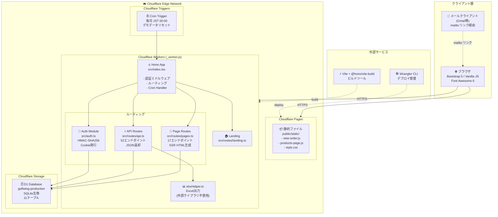
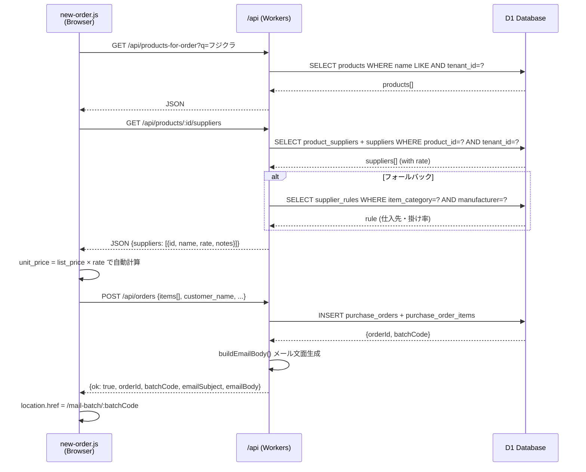
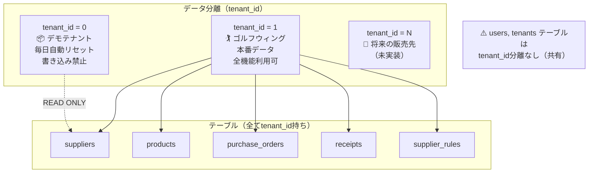
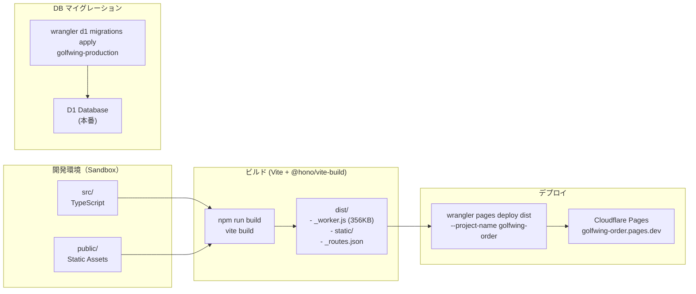

# ARCHITECTURE.md — システム構成図

> **最終更新**: 2026-06-25

---

## 1. システム全体構成図



---

## 2. 認証フロー

```mermaid
sequenceDiagram
    participant B as ブラウザ
    participant W as Workers (Hono)
    participant D as D1 Database

    B->>W: POST /login {username, password}
    W->>D: SELECT users JOIN tenants WHERE username=? AND password=?
    D-->>W: UserRow {tenant_id, is_admin, ...}
    W->>W: createToken("username:tenantId:expires") + HMAC-SHA256署名
    W-->>B: 302 /dashboard + Set-Cookie: gw_session=token; HttpOnly; SameSite=Strict

    Note over B,W: 以降のリクエスト

    B->>W: GET /dashboard + Cookie: gw_session=token
    W->>W: verifyToken() → parseCookie → HMAC検証
    W->>D: SELECT users WHERE username=? AND tenant_id=?
    D-->>W: SessionUser {username, tenantId, displayName, isDemo, isAdmin}
    W->>W: c.set('sessionUser', user)
    W-->>B: 200 HTML

    Note over B,W: デモログイン

    B->>W: GET /demo-login
    W->>W: createToken("demo:0:expires")
    W-->>B: 302 /dashboard + Set-Cookie (tenant_id=0)
    Note over W,D: デモ用はDB照会不要（tenant_id=0で直接復元）
```

---

## 3. データ処理フロー（発注作成）



---

## 4. マルチテナント分離



---

## 5. ビルド・デプロイパイプライン



---

## 6. 環境変数（Cloudflare Secrets）

| 変数名 | 用途 | 必須 |
|---|---|---|
| `AUTH_SECRET` | HMAC署名の秘密鍵 | ✅ 必須（未設定時はデフォルト値を使用、本番では必須） |
| `APP_NAME` | システム表示名 | 任意 |
| `APP_SENDER_NAME` | メール差出人名 | 任意 |
| `APP_SENDER_SHOP` | ショップ名（メール署名） | 任意 |
| `APP_SENDER_ADDR` | 住所（メール署名） | 任意 |
| `APP_SENDER_TEL` | 電話番号（メール署名） | 任意 |
| `APP_SENDER_MAIL` | 差出人メールアドレス | 任意 |
| `APP_DEFAULT_CC` | デフォルトCCアドレス | 任意 |
| `DEMO_MODE` | "1"で強制デモモード | 任意 |
| `AUTH_USERNAME` | 後方互換ユーザー名 | 非推奨 |
| `AUTH_PASSWORD` | 後方互換パスワード | 非推奨 |

---

## 7. 外部依存関係

| サービス | 用途 | 現状 |
|---|---|---|
| Cloudflare Workers | エッジランタイム | ✅ 利用中 |
| Cloudflare D1 | データベース | ✅ 利用中 |
| Cloudflare Pages | ホスティング | ✅ 利用中 |
| Cloudflare Cron Triggers | デモデータリセット | ✅ 利用中 |
| Bootstrap 5 CDN | UIフレームワーク | ✅ 利用中 |
| Font Awesome 6 CDN | アイコン | ✅ 利用中 |
| SendGrid / Resend | メール送信 | ❌ 未統合（現在はmailto:） |
| Slack API | 通知 | ❌ 未統合 |
