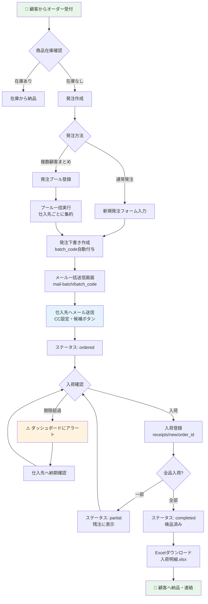
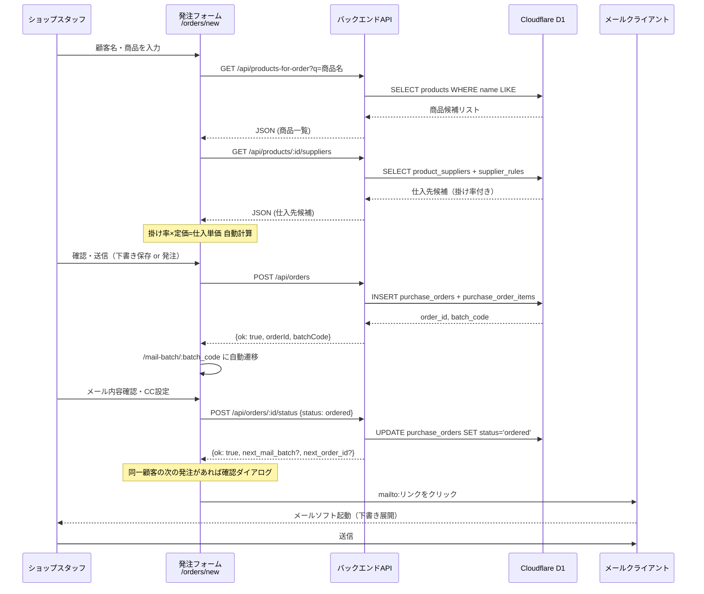
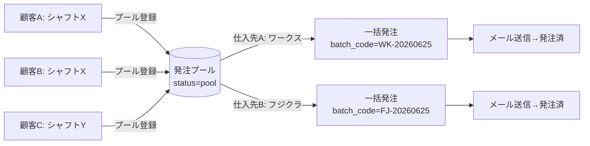
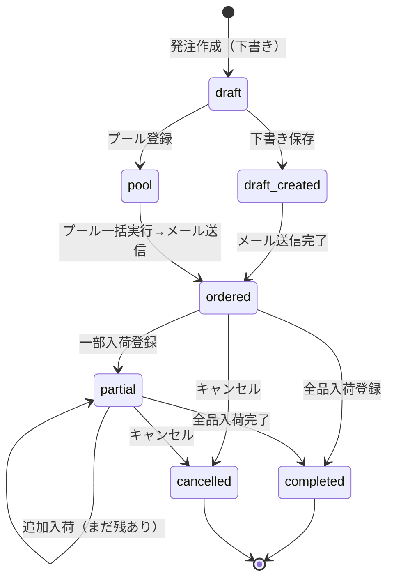
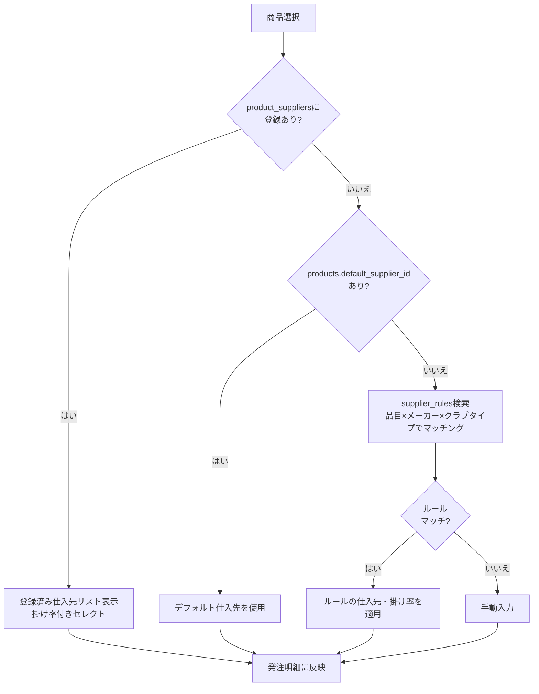
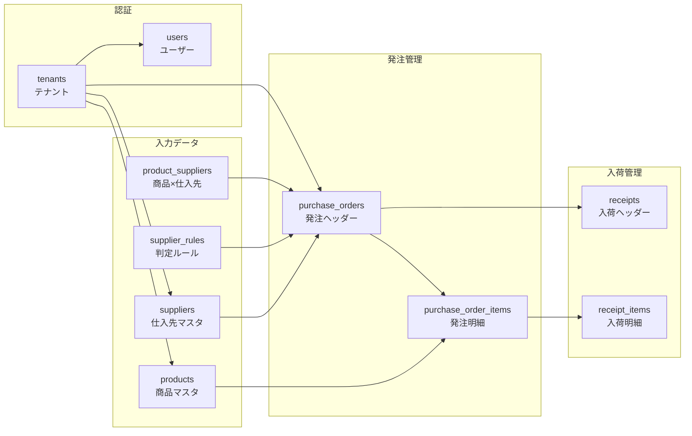

# BUSINESS.md — 業務フロー詳細

> **最終更新**: 2026-06-25

---

## 1. 業務概要

ゴルフウィングは、顧客（ゴルファー）からシャフト・グリップ等のカスタムオーダーを受け、  
仕入先メーカー（フジクラ、グラファイトデザイン、イオミック等）から在庫を仕入れて販売するゴルフショップ。

**主要業務フロー**: 顧客受注 → 仕入先への発注 → 入荷・検品 → 顧客への納品

---

## 2. メイン業務フロー（Mermaid）



---

## 3. 発注作成フロー詳細



---

## 4. 発注プールフロー

複数の顧客分をまとめて1通のメールで発注する際に使用。



---

## 5. 入荷・検品フロー



---

## 6. 仕入先判定ロジック



---

## 7. データの流れ



---

## 8. 承認フロー

現在、**承認フローは実装されていない**。  
ショップスタッフが直接発注メールを送信できる権限を持つ。

```
現状: スタッフ → 発注作成 → メール送信（承認なし）

理想: スタッフ → 発注作成 → 店長承認 → メール送信
```

**課題**: 金額の大きい発注（例：ヘッドを複数本）でも承認なしに発注できてしまう。

---

## 9. 困っていること・課題

| 課題 | 影響 | 優先度 |
|---|---|---|
| メール送信がmailto:リンク経由（クライアントMUA依存） | デバイス・メールソフトによっては動作しない | 高 |
| 承認フローなし | 誤発注リスク | 高 |
| 在庫管理なし | 在庫状況をシステムで把握できない | 中 |
| LINE・FAX発注の手動作業 | 発注方法がメール以外の仕入先は手動で転記 | 中 |
| ユーザー管理UIなし | ユーザー追加・変更にSQL直接操作が必要 | 中 |
| パスワードが平文保存（DB内） | セキュリティリスク | 高 |
| メーカー表記揺れ対応が煩雑 | supplier_rulesに大量の同義語ルールが必要 | 低 |

---

## 10. 改善できること

| 改善案 | 効果 | 難易度 |
|---|---|---|
| メール送信の内部化（SendGrid/Resend） | デバイス依存解消・送信ログ管理 | 中 |
| 承認フロー実装 | 誤発注防止 | 中 |
| パスワードのbcryptハッシュ化 | セキュリティ向上 | 低 |
| メーカー表記揺れの正規化（fuzzy match） | ルール登録作業削減 | 中 |
| 在庫数管理機能追加 | 在庫切れ防止 | 高 |
| Slack通知連携 | 入荷・発注アラートのリアルタイム通知 | 低 |
| ユーザー管理UI | 運用負荷削減 | 低 |
