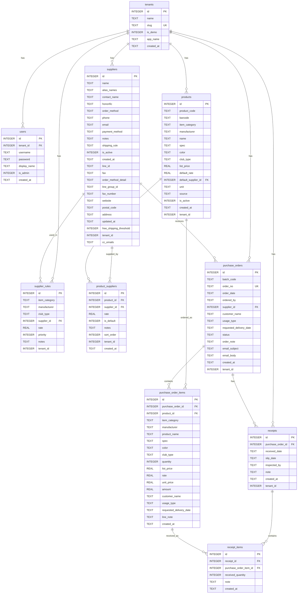

# DATABASE.md — データベース設計詳細

> **最終更新**: 2026-06-25  
> **DB**: Cloudflare D1 (`golfwing-production`) — SQLite互換

---

## 1. ER図



---

## 2. テーブル詳細

### 2.1 `tenants` — テナント管理

| カラム | 型 | NULL | デフォルト | 説明 |
|---|---|---|---|---|
| `id` | INTEGER | NOT NULL | AUTOINCREMENT | テナントID（0=デモ、1=ゴルフウィング） |
| `name` | TEXT | NOT NULL | — | テナント表示名 |
| `slug` | TEXT | NOT NULL | — | 識別子（UNIQUE） |
| `is_demo` | INTEGER | NOT NULL | 0 | 1=デモテナント（毎日リセット） |
| `app_name` | TEXT | NULL | — | システム表示名（NULL時はデフォルト） |
| `created_at` | TEXT | — | CURRENT_TIMESTAMP | 作成日時 |

**初期データ**:
- `(0, 'デモ', 'demo', 1, 'デモ - 発注管理システム')`
- `(1, 'ゴルフウィング', 'golfwing', 0, 'ゴルフウィング 発注管理')`

---

### 2.2 `users` — ユーザー管理

| カラム | 型 | NULL | デフォルト | 説明 |
|---|---|---|---|---|
| `id` | INTEGER | NOT NULL | AUTOINCREMENT | ユーザーID |
| `tenant_id` | INTEGER | NOT NULL | — | テナントID（FK: tenants.id） |
| `username` | TEXT | NOT NULL | — | ユーザー名（tenant_id+usernameでUNIQUE） |
| `password` | TEXT | NOT NULL | — | **⚠️ 平文パスワード**（要改善） |
| `display_name` | TEXT | NULL | — | 表示名 |
| `is_admin` | INTEGER | — | 0 | 1=管理者（バックアップ権限） |
| `created_at` | TEXT | — | CURRENT_TIMESTAMP | 作成日時 |

**初期データ**:
- `(0, 'demo', 'demo1234', 'デモユーザー', 0)`
- `(1, 'admin', 'golfwing2024', '管理者', 1)`

---

### 2.3 `suppliers` — 仕入先マスタ

| カラム | 型 | NULL | デフォルト | 説明 | 追加Migration |
|---|---|---|---|---|---|
| `id` | INTEGER | NOT NULL | AUTOINCREMENT | 仕入先ID | 0001 |
| `name` | TEXT | NOT NULL | — | 仕入先名 | 0001 |
| `alias_names` | TEXT | NULL | — | 別名・略称 | 0001 |
| `contact_name` | TEXT | NULL | — | 担当者名 | 0001 |
| `honorific` | TEXT | NULL | — | 敬称（様、御中等） | 0001 |
| `order_method` | TEXT | NULL | — | 発注方法（メール/LINE/FAX） | 0001 |
| `phone` | TEXT | NULL | — | 電話番号 | 0001 |
| `email` | TEXT | NULL | — | 発注先メールアドレス | 0001 |
| `payment_method` | TEXT | NULL | — | 支払方法 | 0001 |
| `notes` | TEXT | NULL | — | 備考（ログイン情報等） | 0001 |
| `shipping_rule` | TEXT | NULL | — | 送料ルール（テキスト） | 0001 |
| `is_active` | INTEGER | — | 1 | 1=有効 | 0001 |
| `created_at` | TEXT | — | CURRENT_TIMESTAMP | 作成日時 | 0001 |
| `line_id` | TEXT | NULL | — | LINE ID | 0002 |
| `fax` | TEXT | NULL | — | FAX番号 | 0002 |
| `order_method_detail` | TEXT | NULL | — | 発注方法詳細 | 0002 |
| `line_group_id` | TEXT | NULL | — | LINEグループID | 0002 |
| `fax_number` | TEXT | NULL | — | FAX番号（詳細） | 0002 |
| `website` | TEXT | NULL | — | ウェブサイトURL | 0002 |
| `postal_code` | TEXT | NULL | — | 郵便番号 | 0002 |
| `address` | TEXT | NULL | — | 住所 | 0002 |
| `updated_at` | TEXT | NULL | — | 更新日時 | 0002 |
| `free_shipping_threshold` | INTEGER | NULL | — | 送料無料閾値（円） | 0010 |
| `tenant_id` | INTEGER | NOT NULL | 1 | テナントID | 0011 |
| `cc_emails` | TEXT | NULL | — | CC用メールアドレス（カンマ区切り） | 0012 |

---

### 2.4 `products` — 商品マスタ

| カラム | 型 | NULL | デフォルト | 説明 |
|---|---|---|---|---|
| `id` | INTEGER | NOT NULL | AUTOINCREMENT | 商品ID |
| `product_code` | TEXT | NULL | — | 商品コード |
| `barcode` | TEXT | NULL | — | バーコード |
| `item_category` | TEXT | NOT NULL | — | 品目（シャフト/グリップ/ヘッド/ボール/アパレル/工房用品 等） |
| `manufacturer` | TEXT | NULL | — | メーカー名 |
| `name` | TEXT | NOT NULL | — | 商品名 |
| `spec` | TEXT | NULL | — | スペック（重量・フレックス等） |
| `color` | TEXT | NULL | — | カラー |
| `club_type` | TEXT | NULL | — | クラブタイプ（DR/FW/UT/IRON/PT等） |
| `list_price` | REAL | NULL | — | 定価（円） |
| `default_rate` | REAL | NULL | — | デフォルト掛け率（0.0〜1.0） |
| `default_supplier_id` | INTEGER | NULL | — | デフォルト仕入先ID（FK） |
| `unit` | TEXT | — | '本' | 単位 |
| `source` | TEXT | NULL | — | データソース（Excel等） |
| `is_active` | INTEGER | — | 1 | 1=有効 |
| `created_at` | TEXT | — | CURRENT_TIMESTAMP | 作成日時 |
| `tenant_id` | INTEGER | NOT NULL | 1 | テナントID（Migration 0011） |

---

### 2.5 `supplier_rules` — 仕入先判定ルール

| カラム | 型 | NULL | デフォルト | 説明 |
|---|---|---|---|---|
| `id` | INTEGER | NOT NULL | AUTOINCREMENT | ルールID |
| `item_category` | TEXT | NULL | — | 品目（シャフト/グリップ等） |
| `manufacturer` | TEXT | NULL | — | メーカー名 |
| `club_type` | TEXT | NULL | — | クラブタイプ（DR/FW/UT/IRON等、NULL=全種対応） |
| `supplier_id` | INTEGER | NOT NULL | — | 仕入先ID（FK） |
| `rate` | REAL | NULL | — | 掛け率 |
| `priority` | INTEGER | — | 100 | 優先度（低い数値が優先） |
| `notes` | TEXT | NULL | — | 備考 |
| `tenant_id` | INTEGER | NOT NULL | 1 | テナントID（Migration 0011） |

**マッチングロジック**: `item_category AND manufacturer AND (club_type OR club_type IS NULL)` の優先度順で最初のルールを適用。

---

### 2.6 `product_suppliers` — 商品×仕入先（多対多）

| カラム | 型 | NULL | デフォルト | 説明 | 追加Migration |
|---|---|---|---|---|---|
| `id` | INTEGER | NOT NULL | AUTOINCREMENT | ID | 0013 |
| `product_id` | INTEGER | NOT NULL | — | 商品ID（FK） | 0013 |
| `supplier_id` | INTEGER | NOT NULL | — | 仕入先ID（FK） | 0013 |
| `rate` | REAL | NULL | — | この仕入先での掛け率 | 0013 |
| `is_default` | INTEGER | — | 0 | 1=デフォルト仕入先 | 0013 |
| `notes` | TEXT | NULL | — | 備考（急ぎ用・送料条件等） | 0013 |
| `sort_order` | INTEGER | — | 0 | 表示順 | 0013 |
| `tenant_id` | INTEGER | NOT NULL | 0 | テナントID | 0013 |
| `created_at` | TEXT | — | CURRENT_TIMESTAMP | 作成日時 | 0013 |

---

### 2.7 `purchase_orders` — 発注ヘッダー

| カラム | 型 | NULL | デフォルト | 説明 |
|---|---|---|---|---|
| `id` | INTEGER | NOT NULL | AUTOINCREMENT | 発注ID |
| `batch_code` | TEXT | NOT NULL | — | バッチコード（同一仕入先・同日の発注をグループ化） |
| `order_no` | TEXT | NOT NULL | — | 発注番号（UNIQUE） |
| `order_date` | TEXT | NOT NULL | — | 発注日（YYYY-MM-DD） |
| `ordered_by` | TEXT | NULL | — | 発注担当者名 |
| `supplier_id` | INTEGER | NOT NULL | — | 仕入先ID（FK） |
| `customer_name` | TEXT | NULL | — | 顧客名（個人発注の場合） |
| `usage_type` | TEXT | NULL | — | 用途（取替/新品等） |
| `requested_delivery_date` | TEXT | NULL | — | 希望納期 |
| `status` | TEXT | NOT NULL | 'draft' | ステータス（後述） |
| `order_note` | TEXT | NULL | — | 発注備考 |
| `email_subject` | TEXT | NULL | — | メール件名（自動生成） |
| `email_body` | TEXT | NULL | — | メール本文（自動生成） |
| `created_at` | TEXT | — | CURRENT_TIMESTAMP | 作成日時 |
| `tenant_id` | INTEGER | NOT NULL | 1 | テナントID（Migration 0011） |

**statusの値**:

| 値 | 意味 |
|---|---|
| `draft` | 下書き（未保存状態） |
| `draft_created` | 下書き保存済み（まだメール未送信） |
| `pool` | 発注プールに登録中 |
| `ordered` | 発注済み（メール送信完了） |
| `partial` | 一部入荷 |
| `completed` | 全品入荷（完納） |
| `cancelled` | キャンセル |

---

### 2.8 `purchase_order_items` — 発注明細

| カラム | 型 | NULL | デフォルト | 説明 |
|---|---|---|---|---|
| `id` | INTEGER | NOT NULL | AUTOINCREMENT | 明細ID |
| `purchase_order_id` | INTEGER | NOT NULL | — | 発注ID（FK） |
| `product_id` | INTEGER | NULL | — | 商品マスタID（FK、手入力の場合はNULL） |
| `item_category` | TEXT | NOT NULL | — | 品目 |
| `manufacturer` | TEXT | NULL | — | メーカー |
| `product_name` | TEXT | NOT NULL | — | 商品名（スナップショット） |
| `spec` | TEXT | NULL | — | スペック |
| `color` | TEXT | NULL | — | カラー |
| `club_type` | TEXT | NULL | — | クラブタイプ |
| `quantity` | INTEGER | NOT NULL | 1 | 発注数量 |
| `list_price` | REAL | NULL | — | 定価 |
| `rate` | REAL | NULL | — | 掛け率 |
| `unit_price` | REAL | NULL | — | 仕入単価（list_price × rate） |
| `amount` | REAL | NULL | — | 合計金額（unit_price × quantity） |
| `customer_name` | TEXT | NULL | — | 顧客名 |
| `usage_type` | TEXT | NULL | — | 用途 |
| `requested_delivery_date` | TEXT | NULL | — | 希望納期 |
| `line_note` | TEXT | NULL | — | 明細備考 |
| `created_at` | TEXT | — | CURRENT_TIMESTAMP | 作成日時 |

---

### 2.9 `receipts` — 入荷ヘッダー

| カラム | 型 | NULL | デフォルト | 説明 |
|---|---|---|---|---|
| `id` | INTEGER | NOT NULL | AUTOINCREMENT | 入荷ID |
| `purchase_order_id` | INTEGER | NOT NULL | — | 発注ID（FK） |
| `received_date` | TEXT | NOT NULL | — | 入荷日 |
| `slip_date` | TEXT | NULL | — | 納品書日付 |
| `inspected_by` | TEXT | NULL | — | 検品担当者名 |
| `note` | TEXT | NULL | — | 入荷備考 |
| `created_at` | TEXT | — | CURRENT_TIMESTAMP | 作成日時 |
| `tenant_id` | INTEGER | NOT NULL | 1 | テナントID（Migration 0011） |

---

### 2.10 `receipt_items` — 入荷明細

| カラム | 型 | NULL | デフォルト | 説明 |
|---|---|---|---|---|
| `id` | INTEGER | NOT NULL | AUTOINCREMENT | 入荷明細ID |
| `receipt_id` | INTEGER | NOT NULL | — | 入荷ID（FK） |
| `purchase_order_item_id` | INTEGER | NOT NULL | — | 発注明細ID（FK） |
| `received_quantity` | INTEGER | NOT NULL | — | 入荷数量 |
| `note` | TEXT | NULL | — | 明細備考 |
| `created_at` | TEXT | — | CURRENT_TIMESTAMP | 作成日時 |

---

## 3. インデックス一覧

| インデックス名 | テーブル | カラム | 追加Migration |
|---|---|---|---|
| `idx_products_category` | products | item_category | 0001 |
| `idx_products_manufacturer` | products | manufacturer | 0001 |
| `idx_supplier_rules_supplier` | supplier_rules | supplier_id | 0001 |
| `idx_purchase_orders_supplier` | purchase_orders | supplier_id | 0001 |
| `idx_purchase_orders_batch` | purchase_orders | batch_code | 0001 |
| `idx_purchase_orders_status` | purchase_orders | status | 0001 |
| `idx_poi_order` | purchase_order_items | purchase_order_id | 0001 |
| `idx_receipt_items_poi` | receipt_items | purchase_order_item_id | 0001 |
| `idx_receipts_order` | receipts | purchase_order_id | 0001 |
| `idx_products_name` | products | name | 0003 |
| `idx_products_is_active` | products | is_active | 0003 |
| `idx_products_mf_cat` | products | manufacturer, item_category | 0003 |
| `idx_products_active_cat` | products | is_active, item_category | 0003 |
| `idx_products_code` | products | product_code | 0003 |
| `idx_poi_product` | purchase_order_items | product_id | 0003 |
| `idx_receipts_date` | receipts | received_date | 0003 |
| `idx_purchase_orders_date` | purchase_orders | order_date | 0003 |
| `idx_suppliers_tenant` | suppliers | tenant_id | 0011 |
| `idx_products_tenant` | products | tenant_id | 0011 |
| `idx_supplier_rules_tenant` | supplier_rules | tenant_id | 0011 |
| `idx_purchase_orders_tenant` | purchase_orders | tenant_id | 0011 |
| `idx_receipts_tenant` | receipts | tenant_id | 0011 |
| `idx_users_tenant` | users | tenant_id | 0011 |
| `idx_product_suppliers_product` | product_suppliers | product_id, tenant_id | 0013 |
| `idx_product_suppliers_supplier` | product_suppliers | supplier_id, tenant_id | 0013 |

---

## 4. マイグレーション履歴

| ファイル | 内容 | 適用状態 |
|---|---|---|
| `0001_initial_schema.sql` | 初期8テーブル・基本インデックス | ✅ 適用済み |
| `0002_suppliers_order_method.sql` | suppliers: LINE/FAX/住所等カラム追加 | ✅ 適用済み |
| `0003_performance_indexes.sql` | パフォーマンス改善インデックス追加 | ✅ 適用済み |
| `0004_supplier_rules.sql` | supplier_rulesデータ投入（本番データ） | ✅ 適用済み |
| `0005_works_supplier_rules.sql` | ワークス経由メーカーのルール修正 | ✅ 適用済み |
| `0006_excel_update.sql` | suppliers備考・送料情報更新、エリートグリップ追加 | ✅ 適用済み |
| `0010_purchase_pool.sql` | suppliers: free_shipping_threshold追加 | ✅ 適用済み |
| `0011_multi_tenant.sql` | マルチテナント対応（tenants/usersテーブル、全テーブルにtenant_id追加） | ✅ 適用済み |
| `0012_supplier_cc_emails.sql` | suppliers: cc_emailsカラム追加 | ✅ 適用済み |
| `0013_product_suppliers.sql` | product_suppliersテーブル作成 | ✅ 適用済み |

---

## 5. 制約・RLS

### 制約
- `users`: `UNIQUE(tenant_id, username)` — 同一テナント内でユーザー名重複不可
- `purchase_orders`: `order_no` UNIQUE — 発注番号重複不可
- `tenants`: `slug` UNIQUE — テナントスラッグ重複不可
- 全外部キー制約は SQLite の `FOREIGN KEY (col) REFERENCES table(id)` で定義

### RLS（Row Level Security）
Cloudflare D1はRLSをネイティブサポートしていないため、**アプリケーション層でtenant_idによる行フィルタリング**を実施。

```typescript
// 全クエリに tenant_id フィルタを付与する実装パターン
const tenantId = c.get('sessionUser')?.tenantId ?? 1
const rows = await db.prepare(
  'SELECT * FROM suppliers WHERE tenant_id=? AND is_active=1'
).bind(tenantId).all()
```

**⚠️ リスク**: tenant_idフィルタの実装漏れがあると、他テナントのデータが参照される可能性がある。
