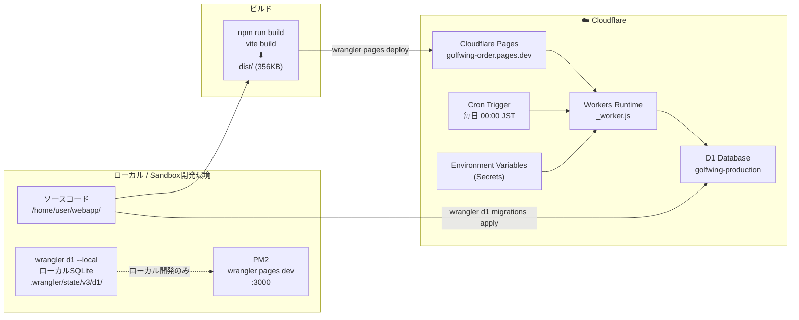

# DEPLOY.md — デプロイ構成

> **最終更新**: 2026-06-25

---

## 1. デプロイ全体構成



---

## 2. Git 管理

### リポジトリ
- **現状**: ローカルGitのみ（GitHub等のリモートリポジトリ未連携）
- **ブランチ**: `main` のみ使用
- **最終コミット**: `1ffc629` "docs: Cowork引き継ぎサマリー(HANDOVER.md)追加"

### .gitignore

```
node_modules/
dist/
.wrangler/
.dev.vars
*.log
*.bak
```

**推奨改善**: GitHub/GitLabへのリモートリポジトリ連携が未実施。  
バックアップは ProjectBackup（tar.gz）で実施している状態。

---

## 3. Cloudflare 設定

### wrangler.jsonc

```jsonc
{
  "$schema": "node_modules/wrangler/config-schema.json",
  "name": "golfwing",
  "compatibility_date": "2026-04-13",
  "pages_build_output_dir": "./dist",
  "compatibility_flags": ["nodejs_compat"],
  "d1_databases": [
    {
      "binding": "DB",
      "database_name": "golfwing-production",
      "database_id": "eb6484c8-67de-48c0-83ee-b250d95f89ef"
    }
  ]
}
```

### Cloudflare Pages プロジェクト

| 項目 | 値 |
|---|---|
| プロジェクト名 | `golfwing` (wrangler.jsonc name) |
| デプロイ名 | `golfwing-order` (npm deploy --project-name) |
| 本番URL | `https://golfwing-order.pages.dev` |
| 最新デプロイURL | `https://daaeba78.golfwing-order.pages.dev` |
| ビルドコマンド | `npm run build` (Cloudflare Pagesダッシュボードでの自動ビルドは未設定) |

---

## 4. データベース（D1）

### 本番データベース

| 項目 | 値 |
|---|---|
| データベース名 | `golfwing-production` |
| データベースID | `eb6484c8-67de-48c0-83ee-b250d95f89ef` |
| 適用済みマイグレーション | 0001〜0013 |

### ローカル開発データベース

```bash
# ローカルSQLiteが自動生成される場所
.wrangler/state/v3/d1/
```

### マイグレーション管理

```bash
# ローカル環境に適用
npx wrangler d1 migrations apply golfwing-production --local

# 本番環境に適用
npx wrangler d1 migrations apply golfwing-production

# 本番DBのSQL直接実行（確認用）
npx wrangler d1 execute golfwing-production --command="SELECT COUNT(*) FROM purchase_orders"
```

---

## 5. デプロイ手順

### 通常デプロイ

```bash
# 1. ビルド
cd /home/user/webapp
npm run build

# 2. Cloudflare Pagesにデプロイ
npx wrangler pages deploy dist --project-name golfwing-order

# 3. 確認
# ブラウザで https://golfwing-order.pages.dev にアクセス
```

### DB変更を伴うデプロイ

```bash
# 1. マイグレーションファイル作成
# migrations/XXXX_description.sql を作成

# 2. ローカルで動作確認
npx wrangler d1 migrations apply golfwing-production --local
npm run build
pm2 start ecosystem.config.cjs  # ローカルサーバー起動

# 3. 本番DBにマイグレーション適用（先にDB変更）
npx wrangler d1 migrations apply golfwing-production

# 4. アプリをデプロイ
npx wrangler pages deploy dist --project-name golfwing-order
```

---

## 6. 環境変数管理

### 本番環境（Cloudflare Pages ダッシュボード）

```bash
# Cloudflare Pages → Settings → Environment Variables で設定
# または wrangler secret put コマンドで設定

wrangler secret put AUTH_SECRET          # 必須: HMAC署名秘密鍵
wrangler secret put APP_SENDER_NAME      # 任意: 差出人名
wrangler secret put APP_SENDER_SHOP      # 任意: ショップ名
wrangler secret put APP_SENDER_ADDR      # 任意: 住所
wrangler secret put APP_SENDER_TEL       # 任意: 電話番号
wrangler secret put APP_SENDER_MAIL      # 任意: 差出人メール
wrangler secret put APP_DEFAULT_CC       # 任意: デフォルトCC
```

### ローカル開発環境

```bash
# .dev.vars ファイルに設定（Git管理外）
cat > .dev.vars << 'EOF'
AUTH_SECRET=local-dev-secret
APP_NAME=発注管理システム（開発）
APP_SENDER_NAME=テストスタッフ
APP_SENDER_SHOP=ゴルフウィング
APP_SENDER_MAIL=test@example.com
EOF
```

---

## 7. ローカル開発環境

### PM2による開発サーバー起動

```bash
# ecosystem.config.cjs の内容:
module.exports = {
  apps: [{
    name: 'golfwing-order',
    script: 'npx',
    args: 'wrangler pages dev dist --d1=golfwing-production --local --ip 0.0.0.0 --port 3000',
    watch: false,
    instances: 1,
    exec_mode: 'fork'
  }]
}

# 起動コマンド:
npm run build  # 必ずビルド後に起動
pm2 start ecosystem.config.cjs
pm2 logs golfwing-order --nostream
```

---

## 8. Cron Trigger

Cloudflare Cron Triggersを使用して毎日デモデータをリセット。

```
スケジュール: 0 15 * * *  (UTC 15:00 = JST 00:00)
ハンドラ: src/index.tsx の scheduled() 関数
処理内容: resetDemoData(env.DB) でtenant_id=0のデータを全削除・再投入
```

**wrangler.jsonc に Cron設定が現在ない場合**、以下を追加:
```jsonc
"triggers": {
  "crons": ["0 15 * * *"]
}
```

---

## 9. 監視・ログ

### Cloudflare Workers ログ

```bash
# リアルタイムログ（Sandbox開発）
pm2 logs golfwing-order --nostream

# Cloudflare ダッシュボード
# Workers & Pages → golfwing → Logs
```

### エラー監視
現在、外部エラー監視サービス（Sentry等）は未設定。  
Cloudflare Pages のビルトインログのみ。

---

## 10. バックアップ戦略

| バックアップ種別 | 方法 | 頻度 |
|---|---|---|
| **コードバックアップ** | ProjectBackup (tar.gz) | 手動（開発完了時） |
| **DBバックアップ** | `/admin/backup` → JSON全データDL | 手動（管理者が実施） |
| **Cloudflare D1自動バックアップ** | Cloudflare標準機能 | 自動（D1 Paidプランのみ） |

**推奨改善**: Cron Triggerを使ったD1の定期自動バックアップ実装（R2への定期エクスポート）。
