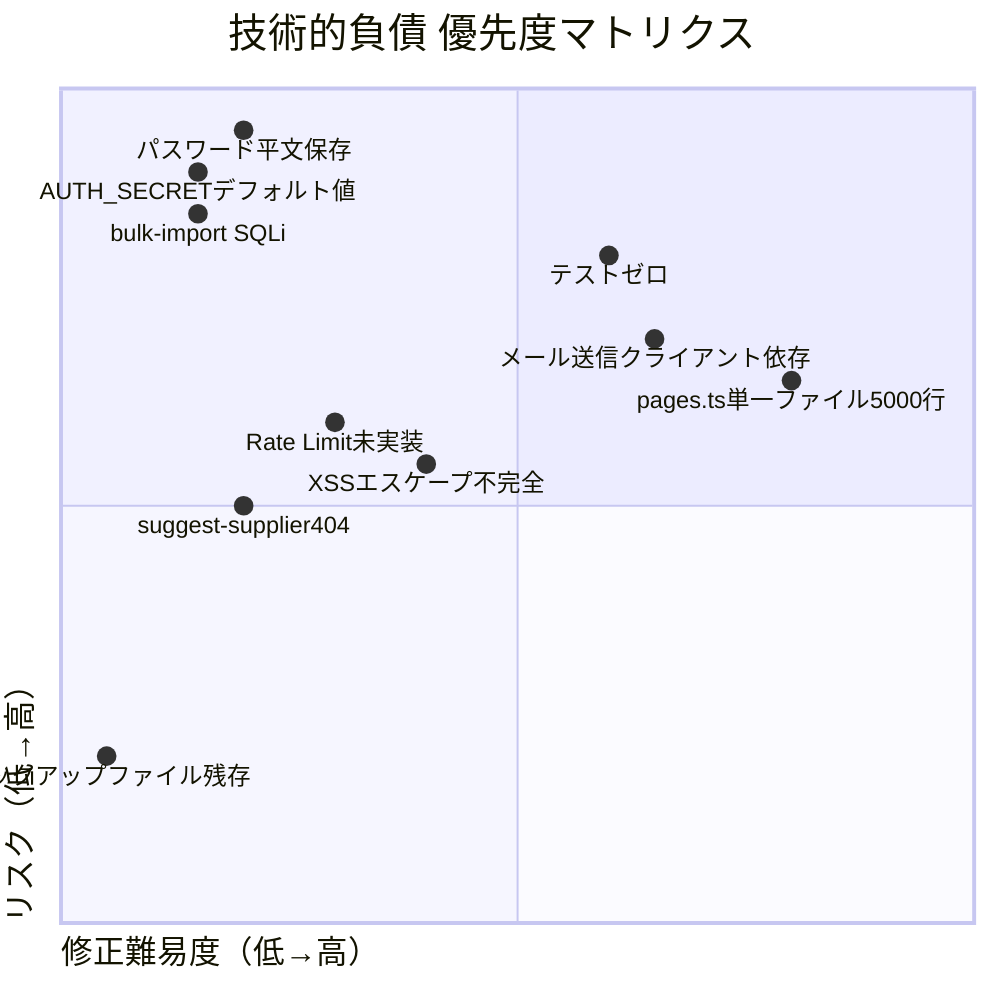

# TECH_DEBT.md — 技術的負債

> **最終更新**: 2026-06-25

---

## 技術的負債マップ



---

## 1. 危険箇所（Critical）

### TD-001: パスワード平文保存
**危険度**: 🔴 Critical  
**修正優先度**: P0（即時対応）

```sql
-- 現状: users テーブルのpasswordが平文
SELECT password FROM users WHERE tenant_id=1;
-- → "golfwing2024" が返る
```

**リスク**: DBが漏洩した場合、全ユーザーのパスワードが即座に判明する。  
**修正方法**: Web Crypto API の PBKDF2 を使ったハッシュ化。

---

### TD-002: AUTH_SECRET デフォルト値ハードコード
**危険度**: 🔴 Critical  
**修正優先度**: P0（即時対応）

```typescript
// src/auth.ts
const DEFAULT_SECRET = 'golfwing-secret-key-change-in-production'
// src/index.tsx
const secret = c.env.AUTH_SECRET || 'golfwing-secret-key-change-in-production'
```

**リスク**: 環境変数未設定の場合、既知の秘密鍵でセッションが発行される。  
攻撃者がトークンを偽造できる。  
**修正方法**: `AUTH_SECRET` が未設定の場合は起動を拒否または強制エラー。

---

### TD-003: bulk-import のSQLインジェクションリスク
**危険度**: 🔴 Critical（条件付き）  
**修正優先度**: P0

```typescript
// api.ts POST /products/bulk-import
const table = body.table  // ユーザー入力
await db.prepare(`INSERT OR REPLACE INTO ${table} (...)`).bind(...).run()
```

**リスク**: `table` にSQL文字列を入れることでDBを破壊できる可能性。  
（ただし認証済みユーザーのみアクセス可能なため、内部不正の場合に問題）  
**修正方法**: ホワイトリスト検証を追加。

---

## 2. 高リスク箇所（High）

### TD-004: テストコードが存在しない
**危険度**: 🟠 High  
**修正優先度**: P1

**リスク**: コード変更時のリグレッション検知が不可能。バグが本番に直行する。  
特に発注作成・ステータス変更・デモリセット等の重要処理に無テスト。  
**修正方法**: vitest + Hono test utilityで最低20ケースのテスト追加。

---

### TD-005: メール送信がクライアントMUA依存（mailto:リンク）
**危険度**: 🟠 High  
**修正優先度**: P1

**リスク**:
- デバイスやブラウザ設定によってはメールクライアントが起動しない
- 送信履歴がシステム上に残らない（監査不可）
- スマートフォンでの操作が困難

**修正方法**: SendGrid/Resend APIによるサーバーサイド送信化。推定工数: 2〜3日

---

### TD-006: suggest-supplier APIが404
**危険度**: 🟠 High（機能欠落）  
**修正優先度**: P1

```javascript
// new-order.js でフォールバックとして呼ばれているが存在しない
fetch('/api/suggest-supplier?...')  // → 404 Not Found
```

**リスク**: `product_suppliers` も `supplier_rules` もマッチしない商品を選択した場合、仕入先自動判定が失敗する。  
**修正方法**: `GET /api/suggest-supplier` エンドポイントを復活させるか、エラーメッセージを改善。

---

### TD-007: XSSエスケープが不一貫
**危険度**: 🟠 High  
**修正優先度**: P1

**リスク**: DBから取得したユーザー入力データ（顧客名・商品名・備考等）がHTMLにエスケープなしで埋め込まれる箇所がある。  
**修正方法**: pages.ts全体でのHTMLエスケープ関数の一貫した適用。

---

## 3. 中リスク箇所（Medium）

### TD-008: pages.ts が5,106行の単一ファイル
**危険度**: 🟡 Medium  
**修正優先度**: P2

**リスク**:
- メンテナンス困難（どこに何があるか把握できない）
- 共通UIコンポーネントの重複（ナビバー等が各ページにコピー）
- 1箇所の変更が他ページに意図せず影響するリスク

**修正方法**: ページごとのファイル分割 + 共通コンポーネント化。推定工数: 3〜5日

---

### TD-009: Rate Limit未実装
**危険度**: 🟡 Medium  
**修正優先度**: P2

**リスク**: ログインへのブルートフォース攻撃が可能。  
**修正方法**: Cloudflare WAFルール or KVを使ったIP別レート制限。推定工数: 半日

---

### TD-010: バックアップファイルの残存
**危険度**: 🟡 Medium（低）  
**修正優先度**: P3

```
src/routes/api.ts.bak          # 古いapi.tsのバックアップ
migrations/0004_supplier_rules.sql.bak  # バックアップSQL
```

**リスク**: 古い認証情報やDB構造が含まれている可能性。バージョン管理を混乱させる。  
**修正方法**: ファイル削除。

---

### TD-011: 承認フローなし
**危険度**: 🟡 Medium  
**修正優先度**: P2

**リスク**: 誰でも（権限のないスタッフも）大額の発注メールを送信できる。  
**修正方法**: 発注額閾値以上の場合は管理者承認フロー追加。推定工数: 3日

---

### TD-012: N+1クエリの可能性
**危険度**: 🟡 Medium  
**修正優先度**: P2

**リスク**: ダッシュボードや発注一覧でループ内クエリが発生している可能性。  
データが増えるとパフォーマンスが劣化する。  
**修正方法**: クエリの見直し（JOIN or IN句 + D1 Batch API活用）。

---

## 4. 低リスク箇所（Low）

### TD-013: uuid5() の誤った命名
**危険度**: 🟢 Low  
**修正優先度**: P4

```typescript
function uuid5(): string {
  return Math.random().toString(36).substring(2, 7).toUpperCase()
  // UUID v5ではなく、ランダムな5文字英数字
}
```

### TD-014: リモートリポジトリなし
**危険度**: 🟢 Low  
**修正優先度**: P3

**リスク**: Sandboxが消失した場合、コードが失われる可能性。  
**修正方法**: GitHub等へのリモートリポジトリ設定。

---

## 5. 技術的負債サマリー

| ID | 内容 | 危険度 | 優先度 | 推定工数 |
|---|---|---|---|---|
| TD-001 | パスワード平文保存 | 🔴 Critical | P0 | 1日 |
| TD-002 | AUTH_SECRETデフォルト値 | 🔴 Critical | P0 | 半日 |
| TD-003 | bulk-import SQLi | 🔴 Critical | P0 | 0.5時間 |
| TD-004 | テストゼロ | 🟠 High | P1 | 3日 |
| TD-005 | メール送信クライアント依存 | 🟠 High | P1 | 2〜3日 |
| TD-006 | suggest-supplier 404 | 🟠 High | P1 | 半日 |
| TD-007 | XSSエスケープ不完全 | 🟠 High | P1 | 1日 |
| TD-008 | pages.ts単一5000行 | 🟡 Medium | P2 | 5日 |
| TD-009 | Rate Limit未実装 | 🟡 Medium | P2 | 半日 |
| TD-010 | バックアップファイル残存 | 🟡 Medium | P3 | 0.1時間 |
| TD-011 | 承認フローなし | 🟡 Medium | P2 | 3日 |
| TD-012 | N+1クエリ | 🟡 Medium | P2 | 1日 |
| TD-013 | uuid5()誤命名 | 🟢 Low | P4 | 0.1時間 |
| TD-014 | リモートリポジトリなし | 🟢 Low | P3 | 1時間 |
