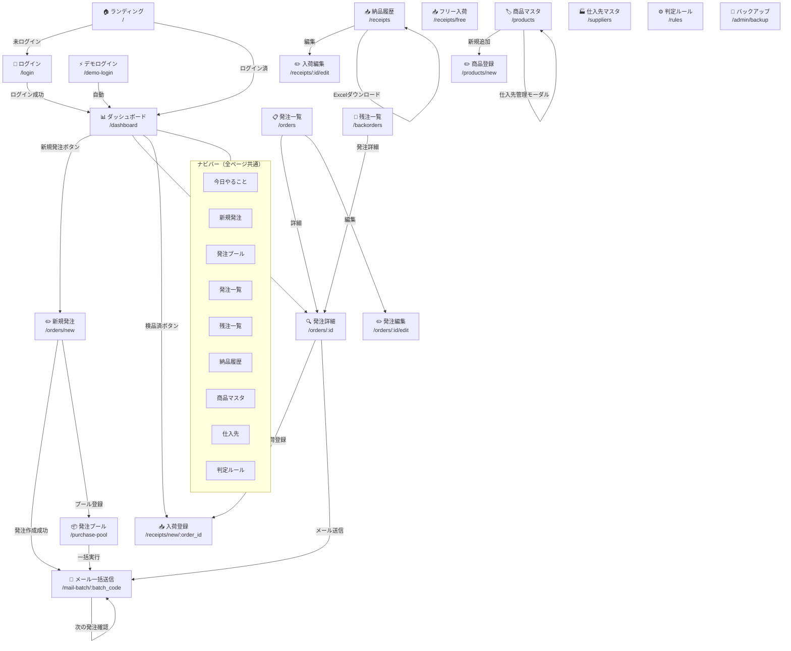

# UI.md — 全画面解析

> **最終更新**: 2026-06-25  
> **デザインテーマ**: ダークグリーン (#0f2417, #1a7a4a) × ホワイト、Bootstrap 5.3

---

## 1. 画面遷移図

---

## 2. 画面一覧

### 画面①: ログイン画面

| 項目 | 内容 |
|---|---|
| **URL** | `/login` |
| **役割** | ユーザー認証・システム入口 |
| **入力** | ユーザー名・パスワード |
| **出力** | Cookie発行 → `/dashboard` リダイレクト |
| **使用API** | POST `/login`（Honoが直接処理） |
| **使用DB** | `users`, `tenants` テーブル |

**UI特徴**:
- ダークグリーン背景 (#0f2417) に白いカード
- ゴルフボールアイコンと「発注管理システム」ロゴ
- 通常ログインフォーム + デモボタン（紫色）
- 「デモを試す（登録不要）」→ `/demo-login` へ遷移

---

### 画面②: ダッシュボード（今日やること）

| 項目 | 内容 |
|---|---|
| **URL** | `/dashboard` |
| **役割** | 業務優先度の一覧表示・当日タスク管理 |
| **入力** | なし（自動集計） |
| **出力** | 対応必要・検品待ち・お客様対応中の各カード |
| **使用API** | GET `/api/dashboard`、GET `/api/dashboard/pending-inspection` |
| **使用DB** | `purchase_orders`, `purchase_order_items`, `receipts`, `receipt_items`, `suppliers` |

**UI特徴**:
- 上部: ステータス別バッジ（下書き/発注済/一部入荷/完納の件数）
- **対応が必要**: 7日以上経過した未入荷発注（オレンジ背景）
- **検品待ち**: 入荷済みで検品未完了（緑背景）
- **お客様対応中**: 発注済みで入荷待ち
- 右上: 「＋ 新規発注」緑ボタン
- デモモード: 上部にアラートバナー + 「導入のお問い合わせ」ボタン

---

### 画面③: 新規発注フォーム

| 項目 | 内容 |
|---|---|
| **URL** | `/orders/new` |
| **役割** | 新しい発注（複数明細）の作成 |
| **入力** | 顧客名・発注日・担当者・商品×複数行（品目・メーカー・商品名・数量・掛け率等） |
| **出力** | 発注レコード作成 → メール送信画面へ遷移 |
| **使用API** | GET `/api/products-for-order`、GET `/api/products/:id/suppliers`、POST `/api/orders` |
| **使用DB** | `products`, `product_suppliers`, `supplier_rules`, `suppliers`, `purchase_orders`, `purchase_order_items` |

**UI特徴**:
- 動的行追加テーブル（「＋ 行を追加」ボタン）
- 商品検索: Ajax補完（インクリメンタルサーチ）
- 仕入先自動判定: 商品選択時に `/api/products/:id/suppliers` で取得
- 複数仕入先時: ドロップダウンセレクト表示
- 掛け率 × 定価 = 仕入単価 の自動計算
- Enterキー誤送信防止: 確認ダイアログ
- 「発注プールに追加」「下書き保存」「発注する」ボタン

---

### 画面④: メール一括送信画面

| 項目 | 内容 |
|---|---|
| **URL** | `/mail-batch/:batch_code` |
| **役割** | 同一バッチの全発注に対するメール作成・送信確認 |
| **入力** | メールアドレス・CC・件名・本文（編集可） |
| **出力** | mailto:リンクでメールクライアント起動、ステータスをorderedに変更 |
| **使用API** | GET `/api/mail-batch/:batch_code`、POST `/api/orders/:id/status` |
| **使用DB** | `purchase_orders`, `purchase_order_items`, `suppliers` |

**UI特徴**:
- 仕入先CC設定: CC候補ボタン（仕入先cc_emailsから）、クリックでトグル追加/削除
- CC入力欄: カンマ区切りで複数CC設定可能
- メール本文: テキストエリアで直接編集可能
- 「発注済みにする」ボタン: クリック後、同一顧客の次の発注確認ダイアログ
- 送料無料閾値表示: 小計がthreshold未満の場合に警告

---

### 画面⑤: 発注一覧

| 項目 | 内容 |
|---|---|
| **URL** | `/orders` |
| **役割** | 全発注の一覧表示・フィルタリング |
| **入力** | フィルタ（ステータス・仕入先・期間） |
| **出力** | 発注一覧テーブル |
| **使用API** | GET `/api/orders` |
| **使用DB** | `purchase_orders`, `suppliers` |

**UI特徴**:
- テーブル形式: 発注日・バッチコード・仕入先・顧客名・金額・ステータス
- ステータスバッジ（色分け）
- ソート・フィルタ機能

---

### 画面⑥: 発注詳細

| 項目 | 内容 |
|---|---|
| **URL** | `/orders/:id` |
| **役割** | 発注の詳細情報・明細・入荷状況の確認 |
| **入力** | なし |
| **出力** | 発注ヘッダー・明細・入荷状況 |
| **使用API** | GET `/api/orders/:id` |
| **使用DB** | `purchase_orders`, `purchase_order_items`, `suppliers`, `receipts`, `receipt_items` |

**UI特徴**:
- 発注ヘッダー情報（発注No・日付・仕入先・顧客名・ステータス）
- 明細テーブル（商品・数量・単価・金額・入荷状況）
- CC設定表示・mailto:リンク
- 「入荷登録」「編集」「コピー」「キャンセル」ボタン

---

### 画面⑦: 発注編集

| 項目 | 内容 |
|---|---|
| **URL** | `/orders/:id/edit` |
| **役割** | 既存発注の明細・ヘッダー情報の編集 |
| **入力** | 既存発注データ（プリフィル済み） |
| **出力** | 発注レコード更新 |
| **使用API** | GET `/api/orders/:id`、PUT `/api/orders/:id/header`、PUT `/api/items/:poi_id`、DELETE `/api/items/:poi_id`、POST `/api/orders/:id/items` |
| **使用DB** | `purchase_orders`, `purchase_order_items`, `suppliers` |

---

### 画面⑧: 発注プール

| 項目 | 内容 |
|---|---|
| **URL** | `/purchase-pool` |
| **役割** | プール中の発注を確認・一括実行・削除 |
| **入力** | なし |
| **出力** | プール発注一覧・仕入先ごとの集計 |
| **使用API** | GET `/api/pool`、GET `/api/pool/items/:order_id`、POST `/api/pool/execute`、DELETE `/api/pool/:order_id` |
| **使用DB** | `purchase_orders`, `purchase_order_items`, `suppliers` |

**UI特徴**:
- 仕入先別にグループ表示
- 小計・送料無料閾値との比較表示
- 「一括実行」「個別削除」ボタン

---

### 画面⑨: 納品履歴（入荷一覧）

| 項目 | 内容 |
|---|---|
| **URL** | `/receipts` |
| **役割** | 入荷済みレコードの一覧・Excel出力 |
| **入力** | フィルタ（日付・仕入先） |
| **出力** | 入荷一覧・Excelダウンロード |
| **使用API** | GET `/api/receipts`、GET `/api/receipts/download` |
| **使用DB** | `receipts`, `purchase_orders`, `suppliers`, `purchase_order_items` |

---

### 画面⑩: 入荷登録

| 項目 | 内容 |
|---|---|
| **URL** | `/receipts/new/:order_id` |
| **役割** | 発注に紐付けた入荷数量の登録 |
| **入力** | 入荷日・入荷数量（明細ごと） |
| **出力** | 入荷レコード作成・発注ステータス更新 |
| **使用API** | POST `/api/receipts` |
| **使用DB** | `receipts`, `receipt_items`, `purchase_order_items`, `purchase_orders` |

---

### 画面⑪: フリー入荷登録

| 項目 | 内容 |
|---|---|
| **URL** | `/receipts/free` |
| **役割** | 発注に紐付かない入荷（急遽取り寄せ等）の登録 |
| **入力** | 仕入先・商品・数量・入荷日 |
| **出力** | フリー入荷レコード作成 |
| **使用API** | POST `/api/receipts/free` |
| **使用DB** | `receipts`, `receipt_items`, `suppliers` |

---

### 画面⑫: 残注一覧（バックオーダー）

| 項目 | 内容 |
|---|---|
| **URL** | `/backorders` |
| **役割** | 発注済みで未入荷・一部入荷の発注追跡 |
| **入力** | なし |
| **出力** | 残注一覧（入荷予定・経過日数付き） |
| **使用API** | GET `/api/backorders` |
| **使用DB** | `purchase_orders`, `purchase_order_items`, `receipts`, `receipt_items`, `suppliers` |

---

### 画面⑬: 商品マスタ

| 項目 | 内容 |
|---|---|
| **URL** | `/products` |
| **役割** | 商品マスタのCRUD・一括インポート・複数仕入先管理 |
| **入力** | 商品情報（品目・メーカー・名前・定価・掛け率等） |
| **出力** | 商品一覧テーブル |
| **使用API** | GET `/api/products`、POST/PUT/DELETE `/api/products/:id`、GET/POST/PUT/DELETE `/api/product-suppliers/:id` |
| **使用DB** | `products`, `product_suppliers`, `suppliers` |

**UI特徴**:
- 大量データ対応（無限スクロールまたはページング）
- Excel一括インポート機能
- 各行に「仕入先」ボタン → 複数仕入先管理モーダル
- モーダル内: 仕入先一覧・掛け率・デフォルト設定・追加・削除

---

### 画面⑭: 商品登録

| 項目 | 内容 |
|---|---|
| **URL** | `/products/new` |
| **役割** | 新規商品のマスタ登録 |
| **入力** | 品目・メーカー・商品名・スペック・定価・掛け率・仕入先等 |
| **出力** | 商品レコード作成 |
| **使用API** | POST `/api/products` |
| **使用DB** | `products`, `suppliers` |

---

### 画面⑮: 仕入先マスタ

| 項目 | 内容 |
|---|---|
| **URL** | `/suppliers` |
| **役割** | 仕入先情報のCRUD・CC設定 |
| **入力** | 仕入先名・担当者・メール・発注方法・CC設定・送料無料閾値等 |
| **出力** | 仕入先一覧テーブル |
| **使用API** | GET `/api/suppliers`、POST/PUT/DELETE `/api/suppliers/:id` |
| **使用DB** | `suppliers` |

**UI特徴**:
- テーブルヘッダー: No/仕入先名/担当者/発注方法/メール/**CC**/送料条件/有効/操作（10列）
- CC列: カンマ区切りで複数CCを設定可能

---

### 画面⑯: 判定ルール管理

| 項目 | 内容 |
|---|---|
| **URL** | `/rules` |
| **役割** | 品目×メーカー×クラブタイプ→仕入先のルール管理 |
| **入力** | 品目・メーカー・クラブタイプ・仕入先・掛け率・優先度 |
| **出力** | ルール一覧テーブル |
| **使用API** | GET `/api/rules`、POST/PUT/DELETE `/api/rules/:id` |
| **使用DB** | `supplier_rules`, `suppliers` |

---

### 画面⑰: バックアップ管理（管理者専用）

| 項目 | 内容 |
|---|---|
| **URL** | `/admin/backup` |
| **役割** | データの手動バックアップ・リストア |
| **入力** | バックアップJSON/CSVファイル（リストア時） |
| **出力** | 全データJSON・テーブル別CSV |
| **使用API** | GET `/api/backup/all`、GET `/api/backup/csv/:table`、POST `/api/backup/restore/all`、POST `/api/backup/restore/csv` |
| **使用DB** | 全テーブル |

**UI特徴**:
- 管理者専用（`is_admin=1`のユーザーのみアクセス可）
- 「全データダウンロード」「テーブル別CSV」ボタン
- リストア: ファイルアップロード → 確認ダイアログ → 実行

---

## 3. 共通UIコンポーネント

### ナビゲーションバー（全ページ）
- 背景: ダークグリーン (#0f2417)
- メニュー: 今日やること / 新規発注 / 発注プール / 発注一覧 / 残注一覧 / 納品履歴 / 商品マスタ / 仕入先 / 判定ルール
- 右端: ユーザー名表示・ログアウトボタン
- デモモード: 上部に「デモモード」アラートバナー

### ステータスバッジ（発注ステータス）
| ステータス | 色 |
|---|---|
| 下書き | グレー |
| 下書き作成済 | 薄グレー |
| プール中 | ライトブルー |
| 発注済 | ブルー |
| 一部入荷 | オレンジ |
| 完納 | グリーン |
| キャンセル | レッド |

### フォントとスタイル
- フォント: Inter (英数字) + Hiragino Sans / Yu Gothic UI (日本語)
- アイコン: Font Awesome 6.4
- CSSフレームワーク: Bootstrap 5.3
