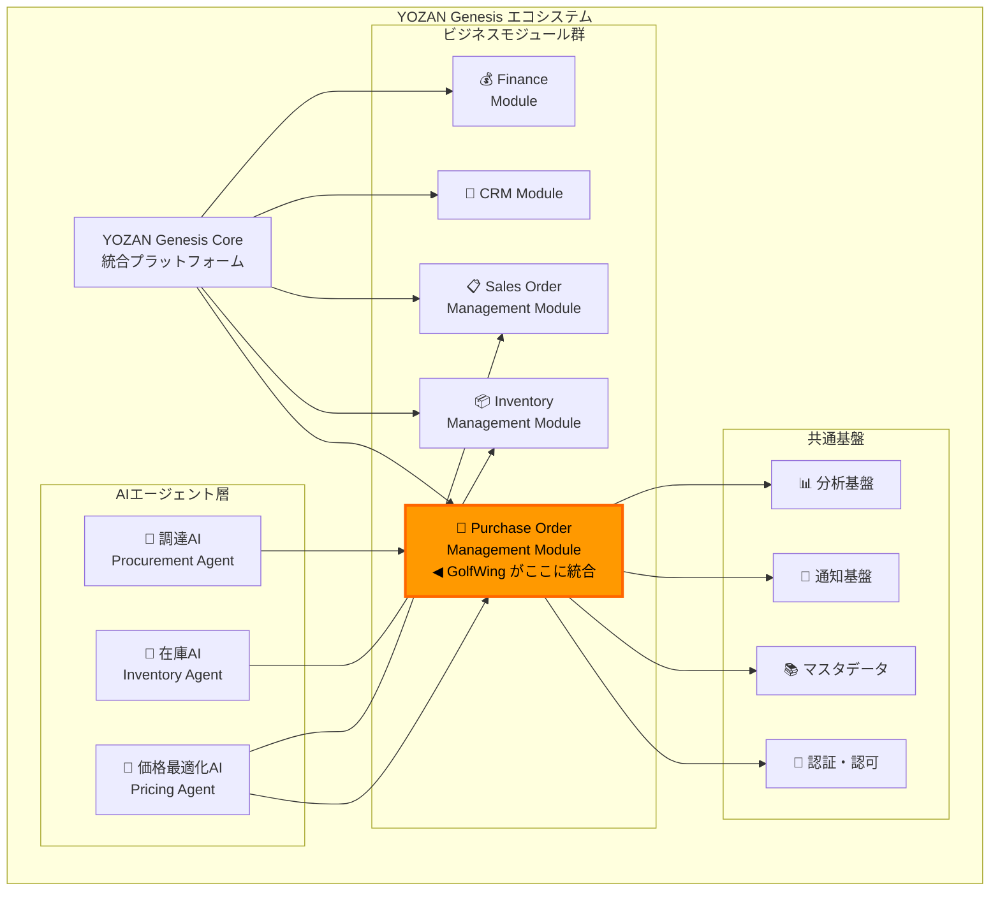
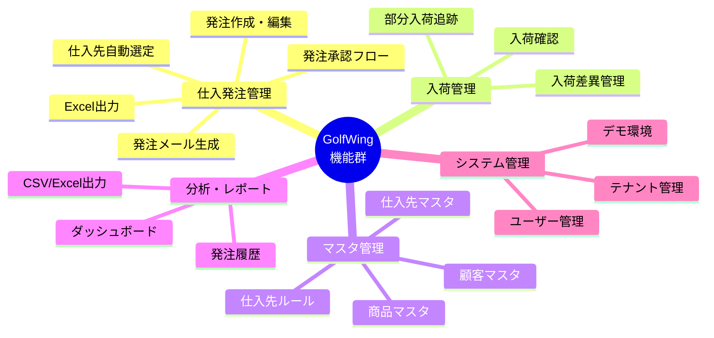
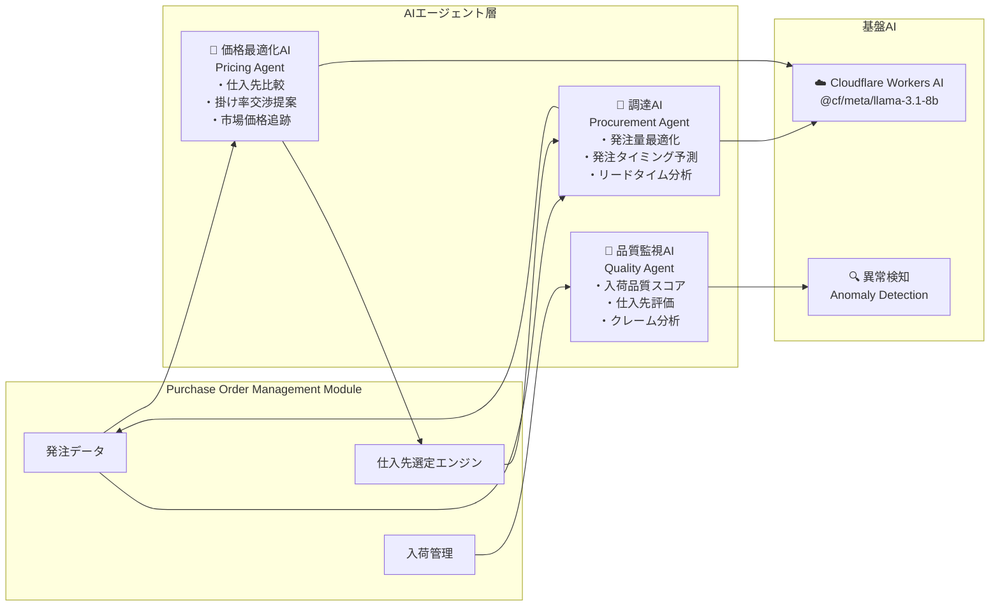
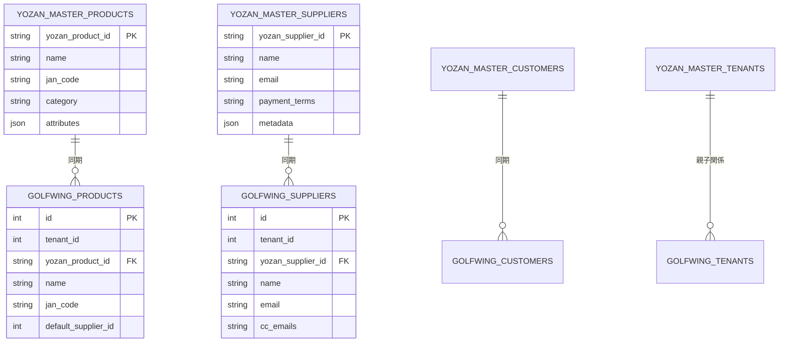
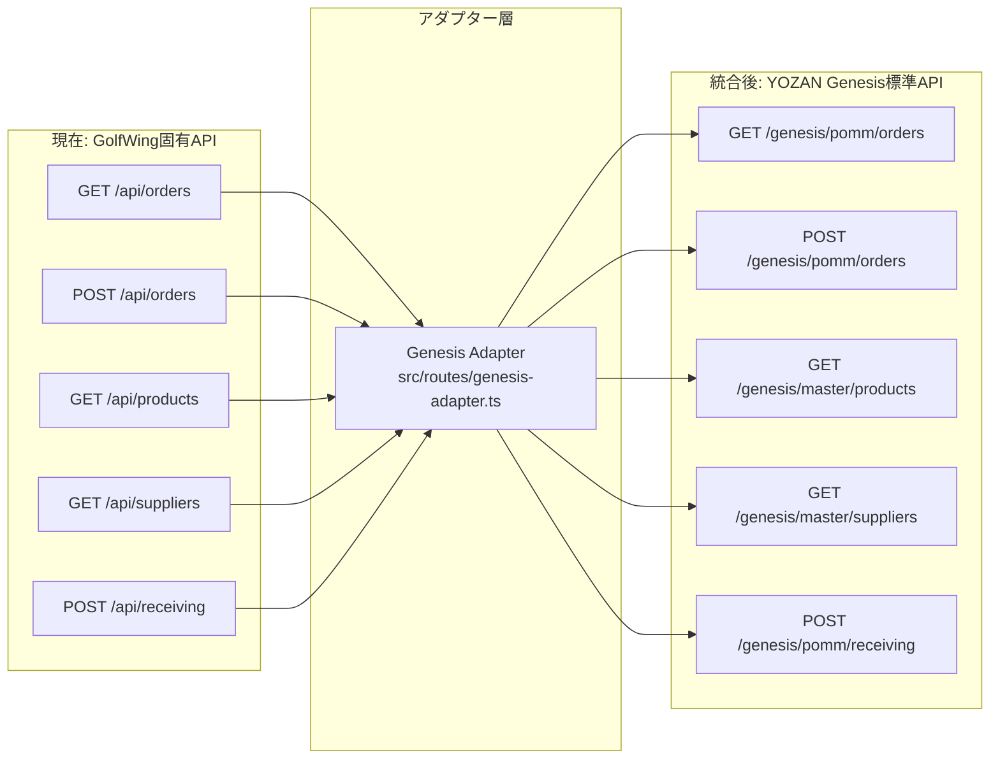
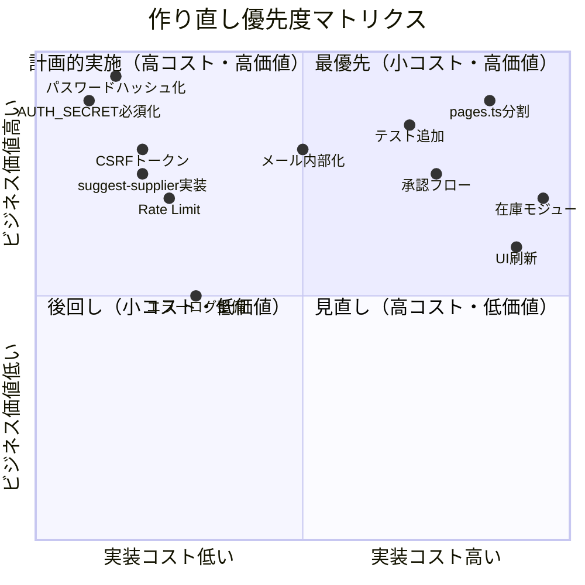
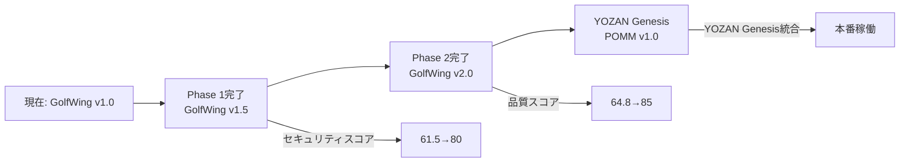
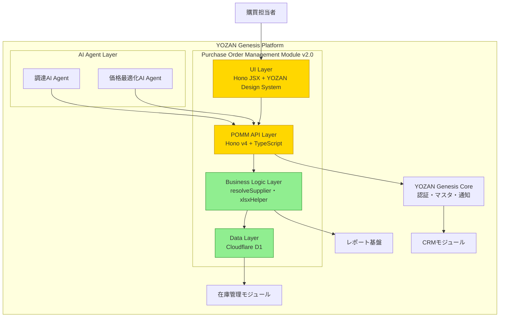

# YOZAN_GENESIS.md — YOZAN Genesis 統合提案

> **GolfWing 仕入発注管理システム → YOZAN Genesis 統合分析**  
> 最終更新: 2025-06-25  
> 目的: GolfWing を YOZAN Genesis エコシステムへ統合するための包括的な技術評価と実装計画

---

## エグゼクティブサマリー

```
┌─────────────────────────────────────────────────────────────────┐
│                    総合評価: 73 / 100                             │
│                                                                  │
│  判定: 🔄 「リファクタリングして使う」                              │
│                                                                  │
│  再利用率: 約 45%   新規実装率: 約 55%                            │
│                                                                  │
│  理由: ビジネスロジックのコア（仕入先判定・発注処理・D1スキーマ）は  │
│  本物の価値があり、全面再構築すると同等の機能を得るまでに            │
│  6〜9ヶ月かかる。一方で、UI層（5,106行単一ファイル）・                │
│  セキュリティ（パスワード平文・CSRF未実装）・テスト（0%）は          │
│  YOZAN Genesis品質基準を満たさないため、段階的刷新が必要。          │
└─────────────────────────────────────────────────────────────────┘
```

---

## 目次

1. [YOZAN Genesis エコシステムにおける位置づけ](#1-yozan-genesis-エコシステムにおける位置づけ)
2. [モジュール分類](#2-モジュール分類)
3. [利用するAI](#3-利用するai)
4. [共通化すべきデータ](#4-共通化すべきデータ)
5. [共通化すべきAPI](#5-共通化すべきapi)
6. [再利用できるコード（45%）](#6-再利用できるコード45)
7. [作り直すべき箇所（55%）](#7-作り直すべき箇所55)
8. [3択判断: なぜ「リファクタリング」か](#8-3択判断-なぜリファクタリングか)
9. [統合実装計画](#9-統合実装計画)
10. [統合後のアーキテクチャ](#10-統合後のアーキテクチャ)
11. [リスクと緩和策](#11-リスクと緩和策)

---

## 1. YOZAN Genesis エコシステムにおける位置づけ

### GolfWing が担うモジュール



### モジュール名称（正式）

```
YOZAN Genesis — Purchase Order Management Module (POMM)
バージョン: 2.0.0（GolfWing v1.0.0 を基に刷新）
カテゴリ: Supply Chain Management
サブカテゴリ: Procurement / Vendor Management
```

---

## 2. モジュール分類

### GolfWing の機能をYOZAN Genesisモジュールに分類



| GolfWing 機能 | YOZAN Genesis モジュール | 優先度 |
|-------------|----------------------|--------|
| 仕入発注 CRUD | Purchase Order Management Module (POMM) | Core |
| 仕入先自動選定 | POMM — Vendor Selection Engine | Core |
| 入荷管理 | POMM — Receiving Management | Core |
| 商品マスタ | 共通マスタデータ基盤 | Shared |
| 仕入先マスタ | 共通マスタデータ基盤 | Shared |
| 顧客マスタ | CRM Module との共有 | Shared |
| 発注メール | 通知基盤（Notification Service） | Shared |
| Excel出力 | レポート基盤（Reporting Service） | Shared |
| 認証・セッション | 共通認証基盤（Auth Service） | Shared |
| マルチテナント | YOZAN Genesis Core 基盤 | Infra |
| デモ環境 | YOZAN Genesis デモ基盤 | Infra |

---

## 3. 利用するAI

### 現在（GolfWing v1.0.0）
AIは未統合。仕入先選定は `resolveSupplier()` 関数（ルールベース）。

### YOZAN Genesis 統合後



#### AIエージェント詳細

| AIエージェント | 役割 | 入力データ | 出力 | 実装優先度 |
|-------------|------|---------|------|----------|
| **調達AI (Procurement Agent)** | 発注量・タイミング最適化 | 発注履歴・在庫量・リードタイム | 発注提案・アラート | Phase 3 |
| **価格最適化AI (Pricing Agent)** | 最適仕入先・掛け率提案 | 仕入先掛け率・市場価格・過去実績 | 仕入先ランキング・交渉提案 | Phase 3 |
| **品質監視AI (Quality Agent)** | 仕入先品質スコア管理 | 入荷記録・差異・クレーム | 仕入先評価レポート | Phase 3 |
| **異常検知 (Anomaly Detection)** | 不審な発注パターン検知 | 発注金額・頻度・仕入先 | アラート・自動ブロック | Phase 2 |

---

## 4. 共通化すべきデータ

### マスタデータ共通化計画



| データ種別 | 現状 | 共通化方針 | 優先度 |
|----------|------|----------|--------|
| **商品マスタ** (`products`) | テナント別独立 | YOZAN Genesisマスタと双方向同期 | 🔴 高 |
| **仕入先マスタ** (`suppliers`) | テナント別独立 | YOZAN Genesisマスタと双方向同期 | 🔴 高 |
| **顧客マスタ** (`customers`) | テナント別独立 | CRMモジュールと共有 | 🟠 中 |
| **仕入先ルール** (`supplier_rules`) | テナント別独立 | POMM内部データ（共有不要） | 🟢 低 |
| **発注データ** (`purchase_orders`) | テナント別独立 | POMM内部データ（分析基盤に読み取り共有） | 🟡 中 |
| **入荷記録** (`receiving_records`) | テナント別独立 | 在庫管理モジュールと共有 | 🟠 中 |

### 共通化実装方針

```typescript
// YOZAN Genesis — Product Sync Interface
interface YozanProduct {
  yozan_product_id: string    // YOZAN Genesis UUID
  name: string
  jan_code?: string
  category: string
  attributes: Record<string, unknown>
  last_synced_at: string
}

// GolfWing products テーブルに追加カラム
// migration 0016_yozan_sync.sql
ALTER TABLE products ADD COLUMN yozan_product_id TEXT;
ALTER TABLE products ADD COLUMN last_synced_at DATETIME;
CREATE UNIQUE INDEX idx_products_yozan_id ON products(yozan_product_id) WHERE yozan_product_id IS NOT NULL;

// 同期API（GolfWing → YOZAN Genesis）
POST /genesis/sync/products   # 商品データをYOZAN Genesisに送信
POST /genesis/sync/suppliers  # 仕入先データをYOZAN Genesisに送信
GET  /genesis/sync/status     # 同期ステータス確認
```

---

## 5. 共通化すべきAPI

### GolfWing APIのYOZAN Genesis化



| 現在のAPI | YOZAN Genesis標準API | 変換内容 | 優先度 |
|---------|---------------------|---------|--------|
| `GET /api/orders` | `GET /genesis/pomm/orders` | ページネーション形式統一・テナントID自動注入 | 🔴 高 |
| `POST /api/orders` | `POST /genesis/pomm/orders` | Requestスキーマ標準化 | 🔴 高 |
| `GET /api/products` | `GET /genesis/master/products` | 商品マスタUUID追加 | 🔴 高 |
| `GET /api/suppliers` | `GET /genesis/master/suppliers` | 仕入先マスタUUID追加 | 🔴 高 |
| `POST /api/receiving` | `POST /genesis/pomm/receiving` | 在庫更新イベント発行 | 🟠 中 |
| `GET /api/suggest-supplier` | `GET /genesis/pomm/suggest-supplier` | AI統合・信頼スコア追加 | 🟠 中 |
| `POST /api/bulk-import` | `POST /genesis/master/import` | 共通インポート基盤に移行 | 🟡 低 |

### APIアダプター実装例

```typescript
// src/routes/genesis-adapter.ts
import { Hono } from 'hono'
import { genesisAuth } from '../middleware/genesisAuth'

const genesisApp = new Hono<{ Bindings: Bindings }>()

// YOZAN Genesis からの認証
genesisApp.use('/*', genesisAuth)

// 発注一覧（YOZAN Genesis標準フォーマット）
genesisApp.get('/pomm/orders', async (c) => {
  const page = Number(c.req.query('page') ?? 1)
  const limit = Number(c.req.query('limit') ?? 20)
  const tenantId = c.get('genesisContext').tenantId

  const { results, meta } = await c.env.DB.prepare(`
    SELECT * FROM purchase_orders WHERE tenant_id = ?
    ORDER BY created_at DESC LIMIT ? OFFSET ?
  `).bind(tenantId, limit, (page - 1) * limit).all()

  return c.json({
    data: results,
    pagination: { page, limit, total: meta.total_count ?? 0 },
    module: 'pomm',
    version: '2.0'
  })
})

// 仕入先提案（AIエージェント連携）
genesisApp.get('/pomm/suggest-supplier', async (c) => {
  const productId = c.req.query('product_id')
  const quantity = Number(c.req.query('quantity') ?? 0)
  
  const supplier = await resolveSupplier(c.env.DB, Number(productId), c.get('genesisContext').tenantId)
  
  return c.json({
    supplier,
    confidence: supplier?.source === 'product_suppliers' ? 1.0 : 0.7,
    reason: supplier?.source ?? 'no_rule',
    ai_suggestion: null,  // Phase 3でAI提案を追加
  })
})

export { genesisApp }
```

---

## 6. 再利用できるコード（45%）

### 🟢 高価値・そのまま再利用（コア部分）

#### resolveSupplier() エンジン（仕入先判定ロジック）
```typescript
// src/routes/api.ts — resolveSupplier()
// 推定200行・テスト後に src/services/vendorSelection.ts として独立化
// ビジネス価値: ★★★★★（このロジックを再実装するには2〜3週間）

async function resolveSupplier(db: D1Database, productId: number, tenantId: number) {
  // 1. product_suppliers テーブル（優先度1）
  // 2. products.default_supplier_id（優先度2）
  // 3. supplier_rules テーブル（優先度3）
}
```
**再利用方針:** ファイルを分離し、依存性注入パターンに変換してテストを追加。

#### D1データベーススキーマ設計
```
再利用可能なスキーマ（Migration 0001〜0013）:
  - purchase_orders / purchase_order_items — 発注の正規化設計
  - product_suppliers — 多対多の適切な設計
  - supplier_rules — 優先順位付きルールエンジン設計
  
再利用方針: スキーマ設計をそのまま移行。
           YOZAN Genesis UUIDカラムを追加。
```

#### xlsxHelper.ts（Excel生成ロジック）
```typescript
// src/xlsxHelper.ts — 298行
// 外部ライブラリ不使用でOOXMLを手動構築
// Workers環境制約（ファイルシステムなし）に最適化済み
// 再利用方針: そのままPOMM共通レポート基盤として移行
```

#### メール文生成ロジック（api.ts内）
```typescript
// 発注メール・入荷メールのテンプレート生成
// 再利用方針: src/services/mailTemplate.ts に分離して再利用
// 将来: Resend API統合時の基盤として使用
```

#### Honoフレームワーク基盤
```typescript
// index.tsx, auth.ts の設計パターン
// - ミドルウェアチェーン設計
// - Bindings型定義
// - エラーハンドリングパターン
// 再利用方針: そのままPOMM基盤として使用
```

### 🟡 部分的に再利用（要リファクタリング）

#### 認証システム（auth.ts — 435行）
```typescript
// 再利用できる部分（約60%）:
// ✅ HMAC-SHA256トークン生成・検証の実装
// ✅ Cookie管理パターン
// ✅ SessionUser型定義
// ✅ 認証ミドルウェア構造

// 作り直す部分（約40%）:
// ❌ パスワード平文比較 → PBKDF2ハッシュに置換
// ❌ DEFAULT_SECRET フォールバック → 必須化
// ❌ YOZAN Genesis認証基盤との統合インターフェース追加
```

#### APIルーター（api.ts — 2,544行）
```typescript
// 再利用できる部分（約70%）:
// ✅ エンドポイント定義・ルーティング構造
// ✅ デモモードブロックmiddleware
// ✅ D1クエリパターン（パラメータバインディング）
// ✅ レスポンス形式

// 作り直す部分（約30%）:
// ❌ bulk-importのSQL文字列連結 → パラメータバインディング
// ❌ N+1クエリパターン → JOINクエリに統合
// ❌ エラーハンドリング不統一 → 共通エラーハンドラー
// ❌ suggest-supplier APIの欠損 → 実装追加
```

#### D1クエリパターン
```typescript
// ほとんどのクエリは適切なパラメータバインディングを使用
// ただし一部のbulk処理で文字列連結が残存
// 再利用方針: 問題箇所を修正してから移行
```

### 🔴 再利用不可（作り直し推奨）

#### pages.ts（5,106行）
```
作り直す理由:
  1. 5,106行の単一ファイルは保守不可能
  2. Bootstrap 5 CDN依存（YOZAN Genesisデザインシステムへの移行必要）
  3. インラインCSS/JSが大量混在
  4. テンプレートリテラルでの大量HTML（型安全性ゼロ）
  5. YOZAN GenesisのUIコンポーネントシステムと非互換

作り直し方針: 
  - Hono JSX + YOZAN Genesisコンポーネントライブラリ
  - 17ファイルに分割（1画面1ファイル）
  - サーバーコンポーネントパターン採用
```

---

## 7. 作り直すべき箇所（55%）

### 優先度別の作り直し計画



### 作り直し詳細

#### 🔴 必須（セキュリティ）
| 項目 | 現状 | 移行後 | 工数 |
|------|------|--------|------|
| パスワード保存 | 平文 | PBKDF2ハッシュ | 1日 |
| AUTH_SECRET | デフォルト値あり | 必須・ローテーション対応 | 半日 |
| CSRF対策 | なし | `hono/csrf` ミドルウェア | 半日 |
| Rate Limit | なし | KV/Durable Objects | 2日 |
| bulk-import | SQL文字列連結 | パラメータバインディング | 0.5日 |

#### 🟠 重要（品質・保守性）
| 項目 | 現状 | 移行後 | 工数 |
|------|------|--------|------|
| pages.ts | 5,106行単一ファイル | 17ファイル分割 + Hono JSX | 4週間 |
| テストコード | 0% カバレッジ | 40% 目標（unit + integration） | 3週間 |
| エラーハンドリング | 不統一 | 共通エラーハンドラー | 1週間 |
| N+1クエリ | 複数箇所 | JOINクエリに統合 | 1週間 |

#### 🟡 推奨（機能強化）
| 項目 | 現状 | 移行後 | 工数 |
|------|------|--------|------|
| メール送信 | mailto:リンク（手動） | Resend API（自動） | 3週間 |
| 承認フロー | なし | ルールベース承認 | 6週間 |
| suggest-supplier | 404エラー | resolveSupplier()活用 | 1週間 |
| ログ整備 | console.log散在 | 構造化ログ（JSON） | 1週間 |

---

## 8. 3択判断: なぜ「リファクタリング」か

### 評価マトリクス

| 評価軸 | そのまま使う | リファクタリング | 全面再構築 |
|-------|------------|----------------|----------|
| 移行期間 | 即時 | 3〜6ヶ月 | 9〜12ヶ月 |
| コスト | 低 | 中 | 高 |
| リスク | セキュリティ危険 | 中（段階的） | 高（全置換） |
| 品質改善 | なし | 大幅改善 | 完全刷新 |
| ビジネス継続 | ✅ | ✅ | ⚠️ 要移行期間 |
| AI対応 | 部分対応 | ✅ | ✅ |
| **推奨** | ❌ | **✅ 推奨** | ❌ |

### 「そのまま使う」を選ばない理由

```
❌ 選ばない理由:
  1. パスワード平文保存（TD-001）— セキュリティインシデントリスク
  2. AUTH_SECRETデフォルト値（TD-002）— 本番環境で実質無署名
  3. CSRF未実装（TD-003）— 現代的なWebアプリとして不十分
  4. テスト0%（TD-005）— YOZAN Genesis品質基準を満たさない
  5. pages.ts 5,106行（TD-004）— AI・人間両方が保守できない規模

  これらはYOZAN Genesisブランドへの統合前に必須修正事項です。
```

### 「全面再構築」を選ばない理由

```
❌ 選ばない理由:
  1. resolveSupplier()の再現コスト — ビジネスルールの学習に2〜3週間
  2. D1スキーマ設計の質 — 13回のマイグレーションで磨かれた設計
  3. xlsxHelper.tsの希少性 — Workers環境でExcel生成できる実装は稀
  4. 実際の業務知識 — コードに埋め込まれた購買業務ロジック
  5. 機会コスト — 9〜12ヶ月の開発期間中ビジネスが止まる

  コアロジックを捨てることは経済的に合理的でない。
```

### 「リファクタリング」を選ぶ理由（根拠付き）

```
✅ 選ぶ理由:

理由1: ビジネスロジックの価値保全
  - resolveSupplier(): product_suppliers → default_supplier_id → supplier_rules
    の3段階優先度ロジックは、実際の購買業務から学習した知識の結晶
  - 全面再構築で同等のロジックを得るには2〜4週間のヒアリング・実装が必要

理由2: DBスキーマの設計品質
  - Migration 0001〜0013の13段階の進化は「実際の課題解決の歴史」
  - product_suppliersの多対多設計、supplier_rulesのルールエンジン設計は正規化が適切
  - 全面再設計でこの品質を最初から出すのは困難

理由3: Workers環境最適化済み
  - xlsxHelper.ts: ファイルシステムなしでExcel生成 → Workers専用最適化
  - Web Crypto API使用のHMACトークン → Node.js Crypto APIを使わない
  - これらの「Workers制約との戦いの成果」を捨てるのは非効率

理由4: 段階的移行が可能
  - Phase 1（セキュリティ修正）: ビジネス継続しながら実施可能
  - Phase 2（pages.ts分割・テスト追加）: 画面ごとに段階的に移行
  - Phase 3（AI統合・YOZAN Genesis接続）: 既存ロジックをAIが活用

理由5: コスト対効果
  - リファクタリング: 〜3ヶ月、中コスト
  - 全面再構築: 〜12ヶ月、高コスト
  - 機能差: Phase 1完了時点でほぼ同等の品質が達成可能
```

---

## 9. 統合実装計画

### Phase 1: セキュリティ基盤強化（〜3ヶ月）
**目標: YOZAN Genesis統合の前提条件を満たす**



| タスク | 担当 | 期間 | 完了条件 |
|------|------|------|---------|
| パスワードハッシュ化 | AI+Human Review | 1日 | 全ユーザー移行完了 |
| AUTH_SECRET必須化 | AI | 半日 | wrangler secret設定済み |
| SQLi修正（bulk-import） | AI | 0.5日 | パラメータバインディング確認 |
| CSRF実装 | AI | 半日 | hono/csrf導入 |
| Rate Limit実装 | AI | 2日 | ログイン5回/分制限確認 |
| ユニットテスト導入 | AI | 3週間 | resolveSupplier()テスト40件 |
| suggest-supplier実装 | AI | 1週間 | 404解消・動作確認 |

### Phase 2: 品質・YOZAN Genesis準備（〜1年）

| タスク | 担当 | 期間 | 完了条件 |
|------|------|------|---------|
| pages.ts 17ファイル分割 | AI+Human Review | 4週間 | 全画面動作確認 |
| Hono JSXコンポーネント化 | AI | 3週間 | テンプレートリテラル削除 |
| メール内部化（Resend） | AI | 3週間 | 送信ログ確認 |
| YOZAN Genesis APIアダプター | AI | 4週間 | `/genesis/pomm/*` エンドポイント |
| マスタデータ同期インターフェース | AI | 3週間 | 商品・仕入先同期テスト |
| 承認フロー | AI+Human Review | 6週間 | 承認なし発注ブロック確認 |

### Phase 3: AI統合・完全YOZAN Genesis化（〜3年）

| タスク | 担当 | 期間 | 完了条件 |
|------|------|------|---------|
| Workers AI統合（調達AI） | AI | 4ヶ月 | 発注提案精度70%以上 |
| 在庫管理モジュール統合 | AI+Human | 3ヶ月 | 入荷後在庫自動更新 |
| YOZAN Genesis完全統合 | AI+Human | 3ヶ月 | シングルサインオン確認 |
| SaaS化（マルチテナント拡張） | AI+Human | 6ヶ月 | 外部テナント3社以上 |

---

## 10. 統合後のアーキテクチャ



**色凡例:**
- 🟢 緑: GolfWing v1.0からそのまま再利用
- 🟡 黄: リファクタリングして移行

---

## 11. リスクと緩和策

| リスク | 確率 | 影響 | 緩和策 |
|-------|------|------|-------|
| **pages.ts分割中のリグレッション** | 高 | 高 | 画面ごとにE2Eテスト作成→分割の順番 |
| **resolveSupplier()のエッジケース** | 中 | 高 | ユニットテスト30件以上を先に作成 |
| **YOZAN Genesis仕様変更** | 中 | 中 | APIアダプター層でバージョン管理・疎結合設計 |
| **D1容量上限（10GB）** | 低 | 中 | 古いデータのR2アーカイブポリシー策定 |
| **認証移行中のセッション無効化** | 低 | 高 | パスワードハッシュ化は段階的移行（フォールバック期間あり） |
| **メール送信先変更への顧客混乱** | 中 | 低 | Fromアドレス維持・送信元ドメインSPF設定 |

---

## まとめ

```
┌─────────────────────────────────────────────────────────────────┐
│ GolfWing → YOZAN Genesis 統合サマリー                            │
│                                                                  │
│ モジュール名: Purchase Order Management Module (POMM) v2.0       │
│                                                                  │
│ 利用AI: 調達AI / 価格最適化AI / 品質監視AI                         │
│                                                                  │
│ 共通化データ: 商品・仕入先・顧客マスタ                               │
│ 共通化API: /genesis/pomm/* (発注) / /genesis/master/* (マスタ)    │
│                                                                  │
│ 再利用率 45%:                                                    │
│   ✅ resolveSupplier()エンジン (推定200行)                        │
│   ✅ D1スキーマ設計 (Migration 0001〜0013)                        │
│   ✅ xlsxHelper.ts (Workers最適化Excel生成)                      │
│   ✅ Hono API構造・D1クエリパターン                                │
│   ✅ メール文生成テンプレート                                       │
│                                                                  │
│ 新規実装率 55%:                                                  │
│   🔨 セキュリティ基盤（パスワードハッシュ・CSRF・Rate Limit）         │
│   🔨 pages.ts分割（5,106行 → 17ファイル + Hono JSX）             │
│   🔨 テストスイート（現在0% → 目標40%）                            │
│   🔨 YOZAN Genesis APIアダプター                                 │
│   🔨 マスタデータ同期インターフェース                               │
│   🔨 メール送信内部化（Resend）                                   │
│   🔨 承認ワークフロー                                             │
│                                                                  │
│ 判定: 🔄 リファクタリングして使う（推奨）                            │
│ 期間: Phase 1 (3ヶ月) + Phase 2 (1年) + Phase 3 (3年)           │
│ 総合スコア: 73/100 → Phase 1完了後 85/100 → 統合後 92/100         │
└─────────────────────────────────────────────────────────────────┘
```

---

## 関連ドキュメント

| ドキュメント | 内容 |
|------------|------|
| [SYSTEM.md](./SYSTEM.md) | システム全体概要 |
| [ARCHITECTURE.md](./ARCHITECTURE.md) | システム構成図 |
| [API.md](./API.md) | 全52エンドポイント詳細 |
| [DATABASE.md](./DATABASE.md) | DB設計・ER図 |
| [SECURITY.md](./SECURITY.md) | セキュリティ監査（61.5/100） |
| [QUALITY.md](./QUALITY.md) | 品質監査（64.8/100） |
| [TECH_DEBT.md](./TECH_DEBT.md) | 技術的負債14件 |
| [ROADMAP.md](./ROADMAP.md) | 段階的改善ロードマップ |
| [AI_CONTEXT.md](./AI_CONTEXT.md) | AI操作ガイド |
| [APP_PASSPORT.md](./APP_PASSPORT.md) | アプリ識別情報 |
